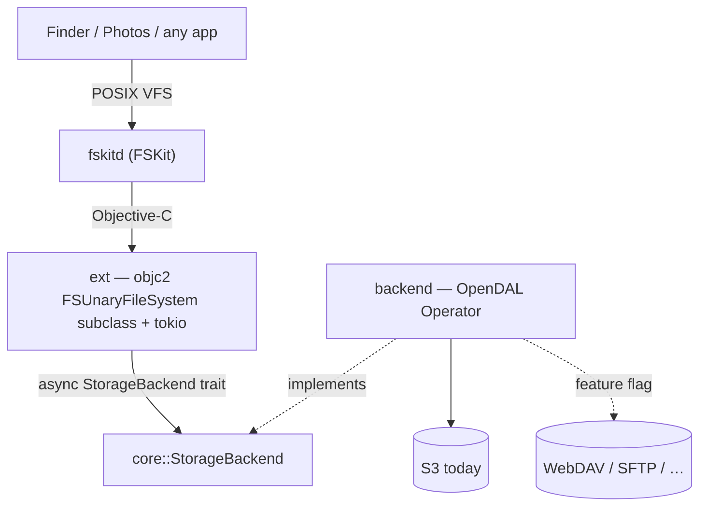

# fskit-s3

Mount an S3 bucket (or any object store) as a **native macOS volume** using
Apple's **FSKit** — a userspace filesystem framework that needs **no kernel
extension** and **no security downgrade** (unlike macFUSE). Written in Rust.



## The one idea to internalise

FSKit hands the extension a tiny request vocabulary — *enumerate this directory*,
*look up / get attributes of this item*, *read this byte range* — and does not
care how they're satisfied. That indifference is the seam. The **entire**
contract between "the Apple side" and "the storage side" is one trait:

```rust
#[async_trait]
pub trait StorageBackend: Send + Sync {
    // read path
    async fn list(&self, dir: &str)  -> Result<Vec<Entry>, StorageError>;
    async fn stat(&self, path: &str) -> Result<Entry,      StorageError>;
    async fn read(&self, path: &str, offset: u64, len: usize) -> Result<Vec<u8>, StorageError>;
    // write path
    async fn create(&self, path: &str, kind: EntryKind) -> Result<(), StorageError>;
    async fn write(&self, path: &str, offset: u64, data: &[u8]) -> Result<(), StorageError>;
    async fn truncate(&self, path: &str, len: u64) -> Result<(), StorageError>;
    async fn remove(&self, path: &str, kind: EntryKind) -> Result<(), StorageError>;
    async fn rename(&self, from: &str, to: &str) -> Result<(), StorageError>;
}
```

Everything above the trait (`ext`) is written against `Arc<dyn StorageBackend>`
and never mentions S3. Everything below it (`backend`) is one OpenDAL adapter.
Adding a storage service (WebDAV, SFTP) touches neither the FSKit glue nor the
trait — it's an OpenDAL feature flag plus, if needed, a constructor.

FSKit's ops map 1:1 onto the trait:

- `enumerateDirectory` → `list`
- `lookupItemNamed` / `getAttributes` → `stat`
- `readFromFile … offset length` → `read`
- `createItemNamed:type:` → `create`
- `writeContents … atOffset` → `write`; `setAttributes:` (size) → `truncate`
- `removeItem` → `remove`; `renameItem` → `rename`

**Write semantics.** Object stores have no partial-write, append, or atomic-
rename primitive — a key is written or copied whole. So `write`/`truncate` are
read-modify-write of the entire object and `rename` is copy-then-delete (server-
side copy on S3, client-side read+write on services without it). That is
O(object size) per call — correct and simple, the deliberate first cut; a future
optimization can buffer a file's writes per open handle and flush once. Because
sizes then change under us, the ext reports the **authoritative** size by
`stat`-ing the backend in `getAttributes`/`setAttributes` rather than trusting
the size cached on the `FSItem` at lookup. Symlinks/hard links can't live in an
object store, so those ops reply `ENOTSUP`.

## Key decisions (and why)

- **Rust, not Swift.** FSKit is a plain Objective-C framework — its headers
  (`FSUnaryFileSystem.h`, `FSVolume.h`, …) are ObjC, with ObjC `@protocol`s and
  block-based reply handlers, and there is no `.swiftinterface`. So it's driven
  from Rust with `objc2`/`define_class!` exactly like the sibling `wayland-macos`
  project drives AppKit. No Swift shim.
- **OpenDAL, not a hand-rolled S3 client.** OpenDAL abstracts ~40 storage
  services behind one `Operator`, so signing (SigV4), XML, retries, and
  pagination are its job. This is the whole backend roadmap (S3 → WebDAV → SFTP)
  in one dependency. The `StorageBackend` trait is still kept as a thin,
  testable seam in front of it (insulation + an in-memory backend for tests).
- **Async (tokio), not blocking.** A network filesystem is latency-bound and
  Finder/Photos issue many parallel reads. The ext owns a multi-threaded tokio
  runtime; each FSKit op `spawn`s the backend future and invokes FSKit's reply
  block on completion, so no queue thread is parked on I/O. `async-trait` keeps
  the trait dyn-compatible.
- **Credentials from the macOS Keychain.** Read at `loadResource:` time, keyed
  by the resource identity — no plaintext secrets on disk, fits the
  app-extension sandbox. (`VolumeState::demo` mounts a credential-free in-memory
  volume so FSKit plumbing can be brought up before this exists.)
- **Target: a general-purpose bucket mount** (now read-write). *Not* Photos —
  see the Photos note below.

## Object-store semantics

Object stores have **no real directories**: there are only keys, and a
"directory" is any prefix keys share. Both backends model this identically —
`list` uses a non-recursive listing (OpenDAL applies the S3 `delimiter=/`) so
files come back plain and subdirectories as entries whose path ends in `/`.
`list` returns names + kinds; **`stat` is the authoritative source of size**
(listings don't reliably carry sizes across services), which also matches
FSKit's enumerate-then-getAttributes flow.

Paths crossing the trait are absolute, `/`-separated, normalized (`core::path`):
root is `"/"`, no trailing slash otherwise, no `.`/`..`. Backends convert to
object keys with `path::to_key` (no leading slash; trailing slash for a dir
prefix).

## Source map

- **`core/src/lib.rs`** — the `StorageBackend` trait, `Entry`/`EntryKind`,
  `StorageError`. Dependency-light (just `async-trait`) so it builds/tests
  anywhere.
- **`core/src/path.rs`** — absolute-path normalization + object-key helpers,
  unit-tested.
- **`core/src/mem.rs`** — `InMemoryBackend`, a flat key→bytes map (behind an
  `RwLock`, since the trait's mutating ops take `&self`) with object-store
  semantics; read-write test fixture + no-credential demo mount (feature `mem`).
- **`backend/src/lib.rs`** — `OpenDalBackend`: `StorageBackend` over any OpenDAL
  `Operator`; `S3Config` + `::s3()` constructor. Tested against OpenDAL's
  in-memory service; an ignored `live_s3_roundtrip` test runs against the
  `compose.yaml` RustFS.
- **`ext/`** — the FSKit extension, in Rust (`staticlib`). `sys.rs`:
  hand-written `objc2` bindings for FSKit classes + the three volume protocols.
  `item.rs`: `FSKitS3Item` (`FSItem` subclass carrying the path). `volume.rs`:
  `FSKitS3Volume` — the read path (activate/lookup/getAttributes/enumerate/read)
  **and** the write path (create/write/setAttributes/remove/rename) against a
  `StorageBackend` on a tokio runtime; only symlink/hard-link ops reply `ENOTSUP`.
  `lib.rs`: `FSKitS3FileSystem` (`FSUnaryFileSystem` delegate) + the exported
  `fskit_s3_make_filesystem` entry point. It **resolves the backend at
  `loadResource`** from the mount's **source path** — the config rides there as a
  self-describing path (`/memory`, or `/s3/<name>?bucket=..&region=..&
  access_key_id=..&endpoint=..`), which FSKit delivers as an `FSPathURLResource`
  (`parse_source_path` → `build_backend`). Resolving at load (Apple's model) means
  a **bad config fails the load**, which fskitd cleanly unwinds — no stuck instance
  / "Resource busy" on retry. `activateWithOptions:` is then trivial. The **secret**
  is never in the path: `Keychain[name]`, or — when the ext can't read the Keychain
  (unsigned build) — an `-o secret` that only arrives at `activate`, so a valid
  config lacking only the secret is *deferred* to activate (`VolumeIvars.pending`),
  not failed. (Earlier this used `-o` config chosen at `activate`; that crashed on
  the teardown path — see the source-path note.)
- **`app/src/`** — `fskit-s3-app`, the macOS app (a status-bar app):
  - `connection.rs` — the `Connection`/`ConnectionKind` (`Memory` | `S3(S3Meta)`)
    model + the persisted `Registry` (`~/Library/Application Support/fskit-s3/
    connections.json`, which **never holds a secret**). `source_path()` emits the
    self-describing mount source (`/memory` or `/s3/<name>?bucket=..&..`); config
    fields must avoid the query delimiters `?&=#` (validated in `from_form`).
  - `keychain.rs` — the S3 secret in the Keychain (`security-framework`),
    preferring a **shared access group** the extension can read (falls back to the
    default keychain when unsigned).
  - `s3check.rs` — the "Test and Save" credential check (lists the bucket via
    `fskit-s3-backend`/OpenDAL, the same backend the extension serves with).
  - `mounts.rs` — the mount table + `mount`/`unmount` (`mount -F -t fskit-s3
    [-o …]`). No bespoke CLI — the system `mount`/`umount` are that.
  - `addwindow.rs` — the connection form (`open` = new, `open_edit` = edit an
    existing connection, pre-filled + name locked, with a red *Delete* button that
    removes it after a confirmation) + the secret-prompt window (native `NSWindow`).
  - `main.rs` + `appkit.rs` — the status-bar UI (`objc2`): *New Connection…* plus a
    submenu per connection (a green/grey status dot + *Mount*/*Unmount* toggle +
    *Update…*). All AppKit FFI stays in `appkit.rs`. A failed *Mount*/*Unmount*
    raises an `NSAlert` (`appkit::show_error`/`confirm`) rather than only logging.
    `classify_mount_error` maps `mount`'s terse text to a specific fix: a stale
    fskitd record (`Code=516`/"already exists") → *run `sudo killall fskitd`* (the
    daemon is root-owned, so the app can't clear it); *Resource busy* → unmount
    first; EINVAL on S3 → offer *Enter Secret…* (the `-o secret` prompt, the usual
    fix when the extension can't read the Keychain on an unsigned build).

  `connection`/`keychain`/`s3check`/`mounts` are pure Rust + unit-tested.
- **`xcode/`** — the non-Rust packaging: the Swift `@main`
  `UnaryFileSystemExtension` bootstrap (returns the Rust class via
  `fskit_s3_make_filesystem`), bridging header, entitlements, and a build recipe.
  ExtensionKit requires this Swift entry; all file-system logic stays in Rust.
  `xcode/host/FskitS3HostApp.swift` is the host app (macOS requires an app to vend
  the extension) — its window is a **live health check** that queries
  `FSClient.installedExtensions` for our module's installed/enabled state and
  self-refreshes, so enabling it in Settings flips it to ✓ (macOS won't let an app
  toggle a file-system extension itself, so it deep-links to the Settings pane).
  It also flags a **build mismatch**: it compares its own git SHA (`FSKitS3GitSHA`
  in its Info.plist) against that of the extension FSKit will actually launch
  (`FSModuleIdentity.url` → that bundle's `FSKitS3GitSHA`). Same SHA ⇒ green; a
  different SHA ⇒ amber "fskitd will launch a DIFFERENT build" — the reliable,
  content-based staleness signal (mtimes lie; git rewrites them on checkout). A
  `-dirty` SHA is shown yellow since two dirty builds can share a SHA. You can
  close it once ready — the extension runs in its own `fskitd`-launched process.
- **`scripts/build-ext-staticlib.sh`** — Xcode Run Script phase: builds the
  `ext` staticlib for the target arch(es) and drops it in `$BUILT_PRODUCTS_DIR`.
  It exports `FSKIT_S3_GIT_SHA` (from `scripts/git-sha.sh`) so `ext/build.rs`
  compiles the SHA into the staticlib — the extension logs it at `activate`
  (`[fskit-s3] activate: build <sha>`), the one signal that reveals daemon-cache
  staleness (right bundle on disk, stale *loaded* process).
- **`scripts/git-sha.sh`** — prints `git describe --always --dirty`; the single
  source of the build SHA. **`scripts/stamp-git-sha.sh`** — a Run Script phase on
  *both* targets that writes that SHA into the built `Info.plist` (`FSKitS3GitSHA`)
  before code-signing, so the host can compare host vs extension.
- **`ext/src/oslog.rs`** — public logging via `os_log` (`%{public}s`). `NSLog`
  output is stored as a redacted argument (shows as `<private>` in `log stream`
  unless private-data mode is on), which hid our diagnostics exactly when needed;
  `log_line` routes through here instead. Filter with
  `log stream --predicate 'subsystem == "dev.lucsoft.fskit-s3"'`.
- **`compose.yaml`** — RustFS (S3-compatible) for local backend testing.
- **`README.md`** (user-facing quickstart) and **`xcode/README.md`** (build /
  enable / triage) both carry **by-hand `mount` examples**. They embed the mount
  contract — the source-path form (`/s3/<name>?bucket=..&..`, `/memory`) and how
  the secret travels — so **update them whenever that contract changes** (e.g. the
  `-o`-config → source-path migration), or they drift into commands that no longer
  work.

## Build & test

```bash
cargo test          # core + backend; backend runs against OpenDAL's memory service
cargo clippy --all-targets -- -D warnings
cargo fmt --all
```

`ext` builds as a `staticlib` with `cargo` (no Xcode needed to compile it). It
only becomes a *loadable* module once linked into the Xcode ExtensionKit target
and codesigned — see `xcode/README.md`. The `com.apple.developer.fskit.fsmodule`
entitlement generally needs a paid Apple Developer Program membership.

### Managing mounts (the app)

`fskit-s3-app` is a ☁ status-bar app. **Add mount…** opens a form to create a
connection — **In-memory** (the demo) or **S3** (endpoint/bucket/region/access-key
+ secret) — with *Save to Keychain*, *Mount when launching*, and *Test & Save*
(validates S3 credentials by listing the bucket). Connections persist to
`connections.json`; the menu mounts/unmounts them and auto-mounts the flagged ones
at launch.

There is **no bespoke CLI**: a connection is realised by the system `mount` tool
with its config as `-o` options, so the app and a plain `mount` do the same thing:

```bash
cargo run -p fskit-s3-app                # the app
# …or by hand (what the app runs — the extension needs an explicit `type`):
# the mount point doubles as the resource arg (its contents are never read), so
# the two path args are identical.
mount -F -t fskit-s3 -o type=memory ~/fskit-s3/memory ~/fskit-s3/memory
umount ~/fskit-s3/memory
```

**How the secret travels.** FSKit exposes **no credential API** — a mount gets a
resource + `FSTaskOptions` (`taskOptions` = the `-o` tokens) and nothing else. So
config rides as `-o` options, and the extension resolves the **secret** as
`Keychain[name]` (the secure default, via a shared keychain access group) **else**
an `-o secret` (insecure, visible in `ps`/`mount`). The extension is a **headless**
app extension and can't prompt, so the *app* prompts for a missing secret. The
config file never stores the secret. Sharing the Keychain item needs a signed
build + the `keychain-access-groups` entitlement on both targets (see
`xcode/README.md`).

### Adding a storage backend (e.g. WebDAV)

1. Enable the OpenDAL feature in `backend/Cargo.toml` (`services-webdav`).
2. Add a constructor next to `OpenDalBackend::s3` that builds the `Operator`.
3. Route to it from the ext's config path. The trait, `core`, and the FSKit glue
   do not change.

## Building & running the extension

The `ext` crate compiles to a Rust `staticlib` linked into an Xcode ExtensionKit
target. **It mounts and serves files today** on macOS 26 (now **read-write** — see
the write-path note above) — the in-memory demo for a `memory` connection, and a
**real S3 bucket** for an S3 connection (config via `-o`, secret from the shared
Keychain group):

```sh
xcodegen generate                 # -> fskit-s3.xcodeproj (from project.yml)
open fskit-s3.xcodeproj           # pick the BBN team, Build & Run the host app
# System Settings ▸ Login Items & Extensions ▸ File System Extensions ▸ enable it
mkdir -p /tmp/fskit-s3-src /tmp/fskit-s3
mount -F -t fskit-s3 /tmp/fskit-s3-src /tmp/fskit-s3   # PathURL resource arg
ls /tmp/fskit-s3                  # -> photos/  readme.txt
cat /tmp/fskit-s3/readme.txt      # -> mounted by fskit-s3
```

Faster iteration without opening Xcode: `xcodebuild -scheme fskit-s3-host
-allowProvisioningUpdates build`, copy the `.app` to `/Applications`, then
`pluginkit -a <appex>` + `pluginkit -e use -i dev.lucsoft.fskit-s3.ext`.

Requires: full Xcode; the restricted `com.apple.developer.fskit.fsmodule`
entitlement (needs a **paid** team + the FSKit Module capability on the App ID).

### FSKit runtime gotchas (each cost hours — don't relearn them)

- **Info.plist**: the `FS*` keys go INSIDE `EXAppExtensionAttributes`, not top
  level. A *complete* module also declares `FSPersonalities`, `FSMediaTypes`, and
  `FSActivate/Check/FormatOptionSyntax`, or `fskit_agent` won't return it to
  `mount` ("No extension with fsShortName found"). Device-less FS →
  `FSSupportsPathURLs = true` (the `mount` resource arg is a path).
- **`ENABLE_DEBUG_DYLIB = NO`**: Xcode 16's stub-executor breaks system-launched
  app extensions.
- **`containerStatus`**: `loadResource` MUST set it to `ready`
  (`FSContainerStatus.ready`) or FSKit rejects with "unexpected container state"
  (POSIX 35). `unloadResource` sets it back to `notReady` so remounts start clean.
- **Singleton delegate**: the Swift `@main` reads `fileSystem` repeatedly, so
  `fskit_s3_make_filesystem` returns one cached instance (else duplicate
  containers register).
- **Stable container UUID** across probe calls (random → two containers/resource).
- **Ownership**: objects FSKit keeps past the reply (the volume from `load`,
  items from `activate`/`lookup`) must be `Retained::into_raw`'d — a borrowed
  pointer dangles and crashes the extension.
- **`enumerate`**: pack `FSItemAttributes` inline in `packEntry`, or entries
  don't show up in `ls`.
- **Item attributes must be COMPLETE**, or FSKit faults
  `getStandardItemAttributesForItem: Reported attributes are incomplete` and tears
  the volume down (Finder's fuller attribute request hits this even when plain
  `ls`/`cat` didn't). The standard set FSKit demands is `type, mode, linkCount,
  uid, gid, flags, size, allocSize, fileID, parentID` **plus the access/modify/
  change/birth `timespec` timestamps** — every op that reports attributes must
  report them all (see `fill_attributes`, used by `getAttributes`, `setAttributes`,
  and `enumerate`; the `size` bit is also read back off `setAttributes`' request
  via `isValid:` to detect a truncate). The
  fault log prints `attributes mask is <got>, expected <want>`; XOR them against
  the `FSItemAttribute` bit values in `FSItem.h` to see which are missing. Passing
  a `timespec` by value needs an `Encode` impl matching `{timespec=qq}` (both
  fields `long`→`q` on 64-bit); a wrong encoding panics the objc2 msg_send in a
  debug build.
- **The reported `mtime` MUST be stable across `getAttributes` calls.** Reporting
  `SystemTime::now()` per call makes the modify time advance between an editor
  opening a file and saving it, so vim/etc. abort a write with *"WARNING: The file
  has been changed since reading it!!!"* (and `make`/`rsync` see phantom changes).
  So `fill_attributes` uses the object's real `last_modified` (S3 provides it;
  `backend::meta_modified` maps it onto `Entry.modified`) and, when the backend has
  no time (directories/prefixes, the in-memory demo), a single process-stable
  instant — never `now()`.
- **The volume must implement `maximumFileSizeInBits` (or `maximumFileSize`)**:
  it's `@optional` in `FSVolumePathConfOperations` but required at runtime —
  otherwise `getMaxFileSizeInBits: … One of them must be implemented`.
- **fskitd persists a mount-point registry**: an uncleanly-ended mount (crash,
  force-unmount, logout while mounted) can orphan an entry, and the next mount of
  the same path fails the *final* step with `Failed to store the mount point in
  settings file! NSCocoaErrorDomain Code=516` ("file exists"). It's not the mount
  folder. Clear it with `sudo killall fskitd` (a clean `diskutil unmount` removes
  the entry; a different mount path also sidesteps it).
- **`-o` options need an option syntax**: to accept `mount -o key=value,…`, the
  Info.plist's `FSActivateOptionSyntax` must declare a getopt string with `o:`
  (Apple's msdos uses `u:g:m:o:`). Empty ⇒ `mount` fails with "Argument count N not
  equal to expected count 2". The extension then reads them from
  `FSTaskOptions.taskOptions`. Connection names must be shell-safe (no spaces/
  slashes) since they ride the `-o` string.
- **`-o` options arrive at the VOLUME's `activateWithOptions:`, NOT at
  `loadResource:options:`** (they're parsed per `FSActivateOptionSyntax`, an
  *activate*-phase syntax). `loadResource`'s `FSTaskOptions.taskOptions` is empty;
  the volume's `mountWithOptions:` is empty too — only `activate` gets the tokens,
  as an argv-style `["-o","type=s3","-o","name=…", …]` array. So the backend must
  be chosen in `activate`, not `load`. Reading options at load ⇒ every mount fails
  the loadResource step with **`Invalid argument` / EINVAL (POSIX 22)** ("mount:
  Loading resource: … Invalid argument"). This masqueraded as a Keychain/config
  problem for a while; it isn't. (Confirmed by dumping `taskOptions` per phase.)
- **Config rides the source PATH, not `-o`; the secret is the exception.** Because
  `-o` options only reach `activate` (above), and an `activate` failure doesn't
  unwind (fskitd leaves a stuck instance → next mount fails at probe with "Resource
  busy"), the connection config is carried in the **source path** instead
  (`/s3/<name>?bucket=..&region=..&access_key_id=..&endpoint=..`, or `/memory`) and
  resolved at `loadResource`, where a bad config fails the *load* — which fskitd
  cleanly tears down. The path need not exist on disk; `?`/`&`/`=` ride fine as
  literal path chars (the `?` shows as `%3F` in the mount table). The **secret** is
  never in the path (it'd show in `ps`/`mount`): `Keychain[name]`, else an
  `-o secret` at `activate` (so a valid config still lacking a secret is *deferred*
  to activate, not failed).
- **An arbitrary-scheme source URL crashes fskitd — use a plain path.** Giving
  `mount` an `s3://…` source (with `FSSupportsGenericURLResources`) makes fskitd
  **segfault** in `-[FSPathURLResource makeProxy]` (it coerces the URL into a path
  resource): `EXC_BAD_ACCESS at 0x20`, before our `loadResource` runs. A real path
  shape (`/s3/…`) goes through fine. So the source is always an `FSPathURLResource`
  path (`FSSupportsPathURLs`), never a generic/`s3://` URL. (An Apple bug — a
  framework shouldn't crash on input — but unavoidable from our side.)
- Nuclear reset for accumulated daemon state: `sudo killall fskitd`.

Next: verify the **write path** end-to-end on a signed build (create/write/mv/rm/
truncate against a real bucket via Finder + shell — the trait and its two backends
are unit-tested, but the FSKit write ops haven't been exercised on device); verify
the S3 read path end-to-end too (framework linking + reading the shared Keychain
group from the `fskitd` sandbox); move the app's "Test & Save" network check off
the main thread. Possible write follow-ups: buffer a file's writes per open handle
and flush once (today each `writeContents` is a whole-object read-modify-write, and
each `getAttributes` on a file costs a `stat`), and serialize concurrent writes to
one path (parallel `writeContents` calls could race the read-modify-write).
(Connection edit + delete are done — each connection's submenu has *Update…*, and
the edit form has a red *Delete* button.)

## The Photos question (deferred)

The original motivation was hosting a **Photos** library on remote storage, which
SMB/NFS-loopback FUSE hacks can't do (Photos rejects network volumes —
`volumeIsLocal == false`). A **block-device** FSKit filesystem mounts as a
genuine *local* volume, clearing that check — but Photos has a second gate
(APFS-class capabilities: copy-on-write cloning, ownership), and whether it keys
on the literal `apfs` format or on advertised capabilities is **untested**. This
project models a *resource (unary)* filesystem, not a block-device one, so Photos
support is a separate track: spike the block-device flavor + the capability gate
before investing. Current target is the general bucket mount.

## Change workflow

Every code change follows the same loop — **never edit on `main` directly**:

1. **Enter a worktree.** Start each change in its own git worktree (isolated
   branch + checkout), so `main` stays untouched while work is in progress.
2. **Complete the change.** Implement it fully and get it green: `cargo test`,
   `cargo clippy --all-targets -- -D warnings`, and `cargo fmt --all` must all
   pass before the change is considered done.
3. **Ask the user for approval.** Summarize what changed and wait for an explicit
   go-ahead. Do **not** push unreviewed work.
4. **Push to `main`.** Once approved, land the change on `main` (merge/fast-forward
   the worktree branch, then push).
5. **Leave the worktree.** Exit the worktree; it's removed once its work is merged.

## Conventions

- Code, comments, commit messages in **English**.
- Async everywhere below the FSKit boundary; keep `core` dependency-light.
- New backend behavior gets a unit test against OpenDAL's memory service (no live
  bucket in tests/CI). Live-endpoint tests are `#[ignore]`d and opt-in via env.
- Errors cross the trait as `StorageError`; the ext is the single place that maps
  them to errno/`FSKitError`.
- **No panics in library code.** `unwrap`/`expect`/`panic!`/indexing are denied
  by clippy outside `#[cfg(test)]` (see the `deny(...)` attrs in `core`/`backend`).
  Prefer `?`, `match`, `.get(..).unwrap_or(..)`, and saturating/checked arithmetic.
- **Wrap `unsafe` in checked safe functions.** All `objc2`/FFI `unsafe` (ext,
  app) lives behind a small safe wrapper that validates arguments and
  null/again-checks results; callers never write `unsafe` directly.
- **Pin dependency features; no `default-features`.** Every dependency sets
  `default-features = false` and lists exactly the features used, each annotated
  with why. This matters most for the `objc2` crates: `default` turns on the whole
  framework, and objc2 gates each type/method behind `cfg(all(feature = "Self",
  feature = "Super", …))`, so a class also needs its full superclass chain (e.g.
  `NSStatusBarButton` → `NSButton` → `NSControl` → `NSView` → `NSResponder`) and
  any cross-cutting feature its signatures touch (`objc2-core-foundation` for
  `CGFloat`; `NSDictionary` for `NSError`'s `userInfo:`). When adding a call,
  build and let the unresolved-import/`no method` errors name the missing feature.
