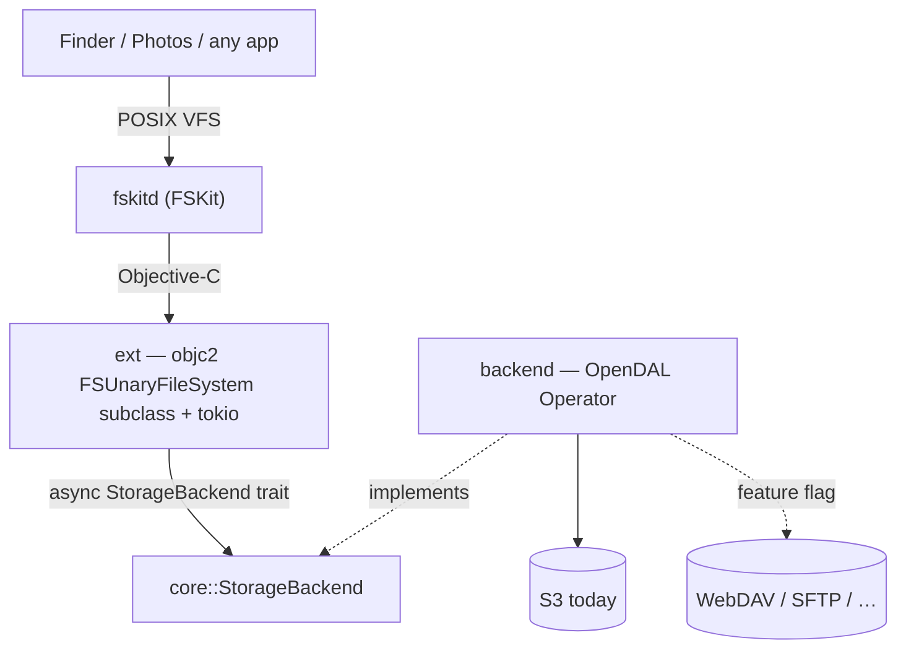

# fskit-s3

Mount an S3 bucket (or any object store) as a **native macOS volume** using
Apple's **FSKit** — a userspace filesystem framework that needs **no kernel
extension** and **no security downgrade** (unlike macFUSE). Written in Rust.



## The one idea to internalise

FSKit hands the extension a tiny request vocabulary — *enumerate this directory*,
*look up / get attributes of this item*, *read this byte range* — and does not
care how they're satisfied. That indifference is the seam. The **entire**
contract between "the Apple side" and "the storage side" is one trait:

```rust
#[async_trait]
pub trait StorageBackend: Send + Sync {
    async fn list(&self, dir: &str)  -> Result<Vec<Entry>, StorageError>;
    async fn stat(&self, path: &str) -> Result<Entry,      StorageError>;
    async fn read(&self, path: &str, offset: u64, len: usize) -> Result<Vec<u8>, StorageError>;
}
```

Everything above the trait (`ext`) is written against `Arc<dyn StorageBackend>`
and never mentions S3. Everything below it (`backend`) is one OpenDAL adapter.
Adding a storage service (WebDAV, SFTP) touches neither the FSKit glue nor the
trait — it's an OpenDAL feature flag plus, if needed, a constructor.

FSKit's ops map 1:1 onto the trait:

- `enumerateDirectory` → `list`
- `lookupItemNamed` / `getAttributes` → `stat`
- `readFromFile … offset length` → `read`

## Key decisions (and why)

- **Rust, not Swift.** FSKit is a plain Objective-C framework — its headers
  (`FSUnaryFileSystem.h`, `FSVolume.h`, …) are ObjC, with ObjC `@protocol`s and
  block-based reply handlers, and there is no `.swiftinterface`. So it's driven
  from Rust with `objc2`/`define_class!` exactly like the sibling `wayland-macos`
  project drives AppKit. No Swift shim.
- **OpenDAL, not a hand-rolled S3 client.** OpenDAL abstracts ~40 storage
  services behind one `Operator`, so signing (SigV4), XML, retries, and
  pagination are its job. This is the whole backend roadmap (S3 → WebDAV → SFTP)
  in one dependency. The `StorageBackend` trait is still kept as a thin,
  testable seam in front of it (insulation + an in-memory backend for tests).
- **Async (tokio), not blocking.** A network filesystem is latency-bound and
  Finder/Photos issue many parallel reads. The ext owns a multi-threaded tokio
  runtime; each FSKit op `spawn`s the backend future and invokes FSKit's reply
  block on completion, so no queue thread is parked on I/O. `async-trait` keeps
  the trait dyn-compatible.
- **Credentials from the macOS Keychain.** Read at `loadResource:` time, keyed
  by the resource identity — no plaintext secrets on disk, fits the
  app-extension sandbox. (`VolumeState::demo` mounts a credential-free in-memory
  volume so FSKit plumbing can be brought up before this exists.)
- **Target: a general-purpose bucket mount** (read-only first). *Not* Photos —
  see the Photos note below.

## Object-store semantics

Object stores have **no real directories**: there are only keys, and a
"directory" is any prefix keys share. Both backends model this identically —
`list` uses a non-recursive listing (OpenDAL applies the S3 `delimiter=/`) so
files come back plain and subdirectories as entries whose path ends in `/`.
`list` returns names + kinds; **`stat` is the authoritative source of size**
(listings don't reliably carry sizes across services), which also matches
FSKit's enumerate-then-getAttributes flow.

Paths crossing the trait are absolute, `/`-separated, normalized (`core::path`):
root is `"/"`, no trailing slash otherwise, no `.`/`..`. Backends convert to
object keys with `path::to_key` (no leading slash; trailing slash for a dir
prefix).

## Source map

- **`core/src/lib.rs`** — the `StorageBackend` trait, `Entry`/`EntryKind`,
  `StorageError`. Dependency-light (just `async-trait`) so it builds/tests
  anywhere.
- **`core/src/path.rs`** — absolute-path normalization + object-key helpers,
  unit-tested.
- **`core/src/mem.rs`** — `InMemoryBackend`, a flat key→bytes map with
  object-store semantics; test fixture + no-credential demo mount (feature
  `mem`).
- **`backend/src/lib.rs`** — `OpenDalBackend`: `StorageBackend` over any OpenDAL
  `Operator`; `S3Config` + `::s3()` constructor. Tested against OpenDAL's
  in-memory service; an ignored `live_s3_roundtrip` test runs against the
  `compose.yaml` RustFS.
- **`ext/src/lib.rs`** — FSKit glue (**skeleton**): the `objc2`
  `FSUnaryFileSystem` subclass + tokio bridge + `StorageError`→errno mapping.
  Not yet in the workspace build.
- **`bundle/`** — `.appex`/host-app `Info.plist`, entitlements, and a Makefile
  that assembles + codesigns the module. **Templates** — reconcile against
  Xcode's FSKit target.
- **`compose.yaml`** — RustFS (S3-compatible) for local backend testing.

## Build & test

```bash
cargo test          # core + backend; backend runs against OpenDAL's memory service
cargo clippy --all-targets -- -D warnings
cargo fmt --all
```

`ext` is **not** in the workspace `members`: it links Apple frameworks and only
yields a loadable module once assembled + codesigned as an app extension. Add it
back to `members` once its bindings compile against a full Xcode toolchain.

### Adding a storage backend (e.g. WebDAV)

1. Enable the OpenDAL feature in `backend/Cargo.toml` (`services-webdav`).
2. Add a constructor next to `OpenDalBackend::s3` that builds the `Operator`.
3. Route to it from the ext's config path. The trait, `core`, and the FSKit glue
   do not change.

## Building the extension (needs full Xcode)

The `ext` crate compiles to the Mach-O inside the `.appex`. A loadable module
requires:

1. **Full Xcode** (App Store). This repo was scaffolded on a machine with only
   Command Line Tools (`xcodebuild` absent); FSKit's extension-point plumbing and
   valid `Info.plist`/entitlements come from Xcode's "File System Extension"
   target. `bundle/*.plist` are best-effort templates to reconcile against it —
   in particular confirm `NSExtensionPointIdentifier` (believed
   `com.apple.fskit.fsmodule`) and that `NSExtensionPrincipalClass` matches the
   ObjC runtime name of the `define_class!`'d type.
2. A **codesigning identity** — `fskitd` refuses an improperly signed module
   (ad-hoc may work for local dev).

Then finish the `objc2` bindings in `ext/src/lib.rs` and assemble:

```bash
make -f bundle/Makefile SIGN_ID="-"   # ad-hoc, or a Developer ID
```

The module appears in **System Settings ▸ General ▸ Login Items & Extensions ▸
File System Extensions** and mounts via `mount -F -t fskit-s3 …`.

First real milestone: mount the **demo in-memory volume** (no credentials) to
prove the FSKit plumbing before wiring S3 config + Keychain.

## The Photos question (deferred)

The original motivation was hosting a **Photos** library on remote storage, which
SMB/NFS-loopback FUSE hacks can't do (Photos rejects network volumes —
`volumeIsLocal == false`). A **block-device** FSKit filesystem mounts as a
genuine *local* volume, clearing that check — but Photos has a second gate
(APFS-class capabilities: copy-on-write cloning, ownership), and whether it keys
on the literal `apfs` format or on advertised capabilities is **untested**. This
project models a *resource (unary)* filesystem, not a block-device one, so Photos
support is a separate track: spike the block-device flavor + the capability gate
before investing. Current target is the general bucket mount.

## Conventions

- Code, comments, commit messages in **English**.
- Async everywhere below the FSKit boundary; keep `core` dependency-light.
- New backend behavior gets a unit test against OpenDAL's memory service (no live
  bucket in tests/CI). Live-endpoint tests are `#[ignore]`d and opt-in via env.
- Errors cross the trait as `StorageError`; the ext is the single place that maps
  them to errno/`FSKitError`.
- **No panics in library code.** `unwrap`/`expect`/`panic!`/indexing are denied
  by clippy outside `#[cfg(test)]` (see the `deny(...)` attrs in `core`/`backend`).
  Prefer `?`, `match`, `.get(..).unwrap_or(..)`, and saturating/checked arithmetic.
- **Wrap `unsafe` in checked safe functions.** All `objc2`/FFI `unsafe` (ext,
  menubar) lives behind a small safe wrapper that validates arguments and
  null/again-checks results; callers never write `unsafe` directly.
