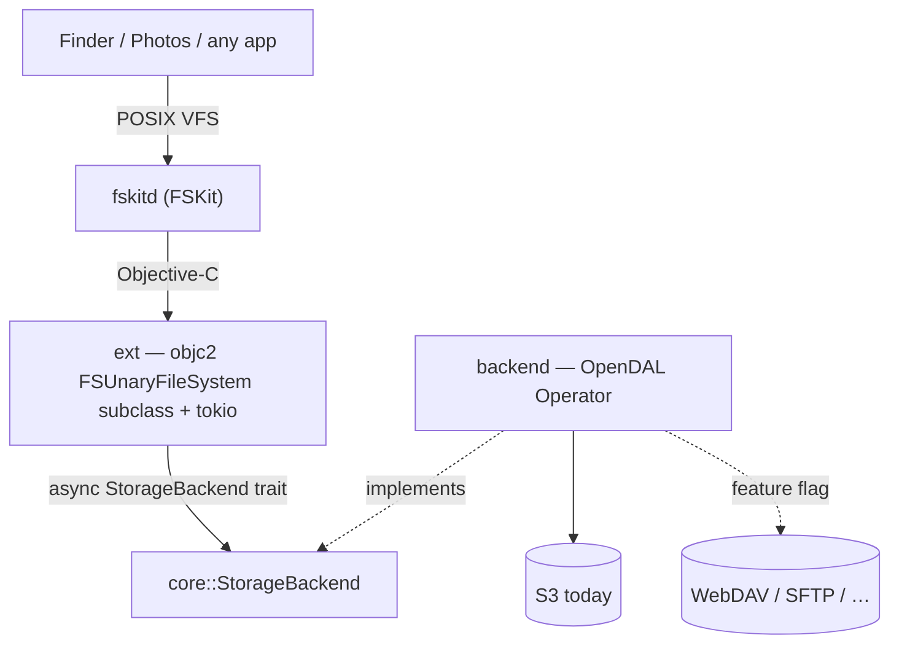

# fskit-s3

Mount an S3 bucket (or any object store) as a **native macOS volume** using
Apple's **FSKit** — a userspace filesystem framework that needs **no kernel
extension** and **no security downgrade** (unlike macFUSE). Written in Rust.



## The one idea to internalise

FSKit hands the extension a tiny request vocabulary — *enumerate this directory*,
*look up / get attributes of this item*, *read this byte range* — and does not
care how they're satisfied. That indifference is the seam. The **entire**
contract between "the Apple side" and "the storage side" is one trait:

```rust
#[async_trait]
pub trait StorageBackend: Send + Sync {
    // read path
    async fn list(&self, dir: &str)  -> Result<Vec<Entry>, StorageError>;
    async fn stat(&self, path: &str) -> Result<Entry,      StorageError>;
    async fn read(&self, path: &str, offset: u64, len: usize) -> Result<Vec<u8>, StorageError>;
    // write path
    async fn create(&self, path: &str, kind: EntryKind) -> Result<(), StorageError>;
    async fn write(&self, path: &str, offset: u64, data: &[u8]) -> Result<(), StorageError>;
    async fn truncate(&self, path: &str, len: u64) -> Result<(), StorageError>;
    async fn remove(&self, path: &str, kind: EntryKind) -> Result<(), StorageError>;
    async fn rename(&self, from: &str, to: &str) -> Result<(), StorageError>;
}
```

Everything above the trait (`ext`) is written against `Arc<dyn StorageBackend>`
and never mentions S3. Everything below it (`backend`) is one OpenDAL adapter.
Adding a storage service (WebDAV, SFTP) touches neither the FSKit glue nor the
trait — it's an OpenDAL feature flag plus, if needed, a constructor.

FSKit's ops map 1:1 onto the trait:

- `enumerateDirectory` → `list`
- `lookupItemNamed` / `getAttributes` → `stat`
- `readFromFile … offset length` → `read`
- `createItemNamed:type:` → `create`
- `writeContents … atOffset` → `write`; `setAttributes:` (size) → `truncate`
- `removeItem` → `remove`; `renameItem` → `rename`

**Write semantics.** Object stores have no partial-write, append, or atomic-
rename primitive — a key is written or copied whole. So `write`/`truncate` are
read-modify-write of the entire object and `rename` is copy-then-delete (server-
side copy on S3, client-side read+write on services without it). That is
O(object size) per call — correct and simple, the deliberate first cut; a future
optimization can buffer a file's writes per open handle and flush once. Because
sizes then change under us, the ext reports the **authoritative** size by
`stat`-ing the backend in `getAttributes`/`setAttributes` rather than trusting
the size cached on the `FSItem` at lookup. Symlinks/hard links can't live in an
object store, so those ops reply `ENOTSUP`.

## Key decisions (and why)

- **Extension in Rust, app UI in SwiftUI.** FSKit is a plain Objective-C framework
  — its headers (`FSUnaryFileSystem.h`, `FSVolume.h`, …) are ObjC, with ObjC
  `@protocol`s and block-based reply handlers, and no `.swiftinterface`. So the
  **extension** is driven from Rust with `objc2`/`define_class!` (like the sibling
  `wayland-macos` project drives AppKit). The **app UI** is the opposite call: it's
  native **SwiftUI** over a **UniFFI** contract (`app/src/ffi.rs` → generated Swift),
  because SwiftUI (menu bar, forms, Liquid Glass) is far nicer than driving AppKit
  from objc2, while the valuable logic stays in testable Rust below the contract. (An
  earlier version drove the whole app UI from Rust/objc2 too; that was replaced.)
- **OpenDAL, not a hand-rolled S3 client.** OpenDAL abstracts ~40 storage
  services behind one `Operator`, so signing (SigV4), XML, retries, and
  pagination are its job. This is the whole backend roadmap (S3 → WebDAV → SFTP)
  in one dependency. The `StorageBackend` trait is still kept as a thin,
  testable seam in front of it (insulation + an in-memory backend for tests).
- **Async (tokio), not blocking.** A network filesystem is latency-bound and
  Finder/Photos issue many parallel reads. The ext owns a multi-threaded tokio
  runtime; each FSKit op `spawn`s the backend future and invokes FSKit's reply
  block on completion, so no queue thread is parked on I/O. `async-trait` keeps
  the trait dyn-compatible.
- **Credentials from the macOS Keychain.** Read at `loadResource:` time, keyed
  by the resource identity — no plaintext secrets on disk, fits the
  app-extension sandbox. (`VolumeState::demo` mounts a credential-free in-memory
  volume so FSKit plumbing can be brought up before this exists.)
- **Target: a general-purpose bucket mount** (now read-write). *Not* Photos —
  see the Photos note below.

## Object-store semantics

Object stores have **no real directories**: there are only keys, and a
"directory" is any prefix keys share. Both backends model this identically —
`list` uses a non-recursive listing (OpenDAL applies the S3 `delimiter=/`) so
files come back plain and subdirectories as entries whose path ends in `/`.
`list` returns names + kinds; **`stat` is the authoritative source of size**
(listings don't reliably carry sizes across services), which also matches
FSKit's enumerate-then-getAttributes flow.

Paths crossing the trait are absolute, `/`-separated, normalized (`core::path`):
root is `"/"`, no trailing slash otherwise, no `.`/`..`. Backends convert to
object keys with `path::to_key` (no leading slash; trailing slash for a dir
prefix).

## Source map

- **`core/src/lib.rs`** — the `StorageBackend` trait, `Entry`/`EntryKind`,
  `StorageError`. Dependency-light (just `async-trait`) so it builds/tests
  anywhere.
- **`core/src/path.rs`** — absolute-path normalization + object-key helpers,
  unit-tested.
- **`core/src/mem.rs`** — `InMemoryBackend`, a flat key→bytes map (behind an
  `RwLock`, since the trait's mutating ops take `&self`) with object-store
  semantics; read-write test fixture + no-credential demo mount (feature `mem`).
- **`backend/src/lib.rs`** — `OpenDalBackend`: `StorageBackend` over any OpenDAL
  `Operator`; `S3Config` + `::s3()` constructor (which wraps the operator in a
  `RetryLayer` so *transient* S3 errors — 503 SlowDown, 500, dropped keep-alives
  under the parallel load a filesystem generates — are retried transparently
  instead of surfacing to apps; persistent errors like auth/not-found still fail
  fast). Tested against OpenDAL's
  in-memory service. **`backend/tests/live_s3.rs`** — `#[ignore]`d integration
  tests against a real endpoint (the `compose.yaml` RustFS by default,
  overridable via `FSKIT_S3_*`): a full file lifecycle (create → update → update
  → check stats + modified → delete), that the reported mtime advances on a write
  but is *stable* across stats of an untouched file (the editor "changed since
  reading" property), and S3's server-side-copy `rename`. They gate on
  `RUSTFS_ENDPOINT` and use unique per-run key prefixes, so they self-skip without
  it and never depend on seeded bucket state (real use churns it).
- **`ext/`** — the FSKit extension, in Rust (`staticlib`). `sys.rs`:
  hand-written `objc2` bindings for FSKit classes + the three volume protocols.
  `item.rs`: `FSKitS3Item` (`FSItem` subclass carrying the path). `volume.rs`:
  `FSKitS3Volume` — the read path (activate/lookup/getAttributes/enumerate/read)
  **and** the write path (create/write/setAttributes/remove/rename) against a
  `StorageBackend` on a tokio runtime; only symlink/hard-link ops reply `ENOTSUP`.
  `removeItem` resolves its target from **(directory, name)**, not the `item`
  pointer (FSKit sometimes hands callbacks a null/foreign item), so deletes can't
  silently no-op and leak. `junk.rs`: `is_hidden` — the macOS volume-litter
  filter. macOS treats the mount as a real local volume and its daemons write
  `.fseventsd`/`.Spotlight-V100`/`.Trashes`/`.TemporaryItems`/`.DS_Store`/`._*`;
  the ext refuses to create these (`createItem`→EPERM) and hides them
  (`lookup`→ENOENT, skipped in `enumerate`) so they never reach the backend.
  Editor scratch (`4913` probes, `.swp`, `~`) and atomic-save temps (`*.sb-*`) are
  deliberately **not** hidden — they belong to a real write flow and are cleaned up
  by the tool that made them.
  `lib.rs`: `FSKitS3FileSystem` (`FSUnaryFileSystem` delegate) + the exported
  `fskit_s3_make_filesystem` entry point. It **resolves the backend at
  `loadResource`** from the mount's **source path** — the config rides there as a
  self-describing path (`/memory`, or `/s3/<name>?bucket=..&region=..&
  access_key_id=..&endpoint=..`), which FSKit delivers as an `FSPathURLResource`
  (`parse_source_path` → `build_backend`). Resolving at load (Apple's model) means
  a **bad config fails the load**, which fskitd cleanly unwinds — no stuck instance
  / "Resource busy" on retry. A special `type=_info` source (`/_info`) is the
  **version probe**: `build_backend` returns `Err("fskit-s3 running: version=<v>
  sha=<sha>")`, so `mount -F -t fskit-s3 /_info <point>` *fails the load* carrying the
  **running** build's identity (compiled-in `CARGO_PKG_VERSION` + `FSKIT_S3_GIT_SHA`).
  The `version=…/sha=…` shape is a contract the app parses (`mounts::probe_info`) to
  see what's actually loaded, not just what's on disk. `activateWithOptions:` is then trivial. The **secret**
  is never in the path: `Keychain[name]`, or — when the ext can't read the Keychain
  (unsigned build) — an `-o secret` that only arrives at `activate`, so a valid
  config lacking only the secret is *deferred* to activate (`VolumeIvars.pending`),
  not failed. (Earlier this used `-o` config chosen at `activate`; that crashed on
  the teardown path — see the source-path note.)
- **`app/src/`** — `fskit-s3-app`, the logic + **UniFFI contract** behind the app;
  the UI is native SwiftUI (see `xcode/host/`). All modules are dependency-light
  Rust; `connection`/`keychain`/`s3check`/`mounts` are pure + unit-tested.
  - `connection.rs` — the `Connection`/`ConnectionKind` (`Memory` | `S3(S3Meta)`)
    model + the persisted `Registry` (`~/Library/Application Support/fskit-s3/
    connections.json`, which **never holds a secret**). `source_path()` emits the
    self-describing mount source (`/memory` or `/s3/<name>?bucket=..&..`); config
    fields must avoid the query delimiters `?&=#` (validated in `from_form`). The
    **mount point** is separate from the source: `mount_point()` returns the user's
    chosen folder (`Connection.mount_point`, picked at creation and required to be an
    *empty* directory — checked in `save_connection`) or the default
    `~/fskit-s3/<name>`.
  - `keychain.rs` — the S3 secret in the Keychain (`security-framework`),
    preferring a **shared access group** the extension can read (falls back to the
    default keychain when unsigned).
  - `disksecret.rs` — a **dev-only, insecure** alternative to the Keychain: the
    secret as a `0600` **plaintext** file (`~/Library/Application Support/fskit-s3/
    secrets/<name>`, beside but never inside `connections.json`). For unsigned builds
    where the extension can't read the shared Keychain group; opt-in per connection
    (`save_secret_to_disk`). The app reads it back at mount and hands it to the ext
    via `-o secret` — no extension changes, so the secret still rides the command
    line (visible in `ps`/`mount`); the win is that one-click and launch mounts stop
    re-prompting. `ffi::secret_plan` **always supplies the secret via `-o secret`**
    when the app has one — dev disk file first (the raw password), then any Keychain
    copy — and only reports `Missing` (→ prompt/skip) when there's none. It does *not*
    try to mount with `secret = None` hoping the extension reads the shared Keychain
    itself: the app reading a shared-group item does **not** mean the *extension* can
    (on an unsigned build the app's read succeeds while the ext's fails, so `None`
    mounts nothing and the ext dies with `no secret`). On a signed build the ext still
    prefers its own Keychain read and ignores the `-o` value, so nothing is lost.
  - `s3check.rs` — the "Test and Save" credential check (lists the bucket via
    `fskit-s3-backend`/OpenDAL, the same backend the extension serves with).
  - `mounts.rs` — the mount table + `mount`/`unmount` (`mount -F -t fskit-s3
    [-o …]`). No bespoke CLI — the system `mount`/`umount` are that. `unmount`
    removes the now-empty mount-point dir **only when it's app-managed** (under
    `~/fskit-s3/`); a user-chosen mount folder is left alone.
  - `health.rs` — the FSKit extension-health check via `FSClient`
    (`fetchInstalledExtensionsWithCompletionHandler:`, bridged to a synchronous
    `check()` with a `block2` completion + an `mpsc` channel and a short timeout):
    installed/enabled state, plus a **build-mismatch** check comparing the git SHA
    (`FSKitS3GitSHA` in the Info.plist) of the bundle FSKit will launch
    (`FSModuleIdentity.url`) against this app's own. When the module is **enabled** it
    goes one better: it probes the *running* process via `mounts::probe_info()` (the
    `/_info` mount — see below) and uses that SHA for the freshness verdict, so it
    catches the daemon-cache case the bundle SHA can't (right bundle on disk, stale
    *loaded* process). `check()` **blocks** (now also on the probe mount), so the
    SwiftUI side calls it off the main actor (a `Task.detached`).
  - `autostart.rs` — launch-at-login via `SMAppService.mainApp` (register + status);
    best-effort (a dev build that can't register just won't auto-start).
  - `ffi.rs` — the **UniFFI contract**: `#[uniffi::export]` functions +
    `#[derive(uniffi::Record/Enum/Error)]` on the app-layer types — the whole surface
    the SwiftUI app calls (health, connection CRUD + form validation, Keychain,
    mounting, the S3 test). Presentation (SF Symbols, colours, windows) stays on the
    Swift side; the secret **never crosses back to Swift** — the edit form only learns
    *whether* one is stored (`has_secret`) and shows a dots placeholder; leaving it
    untouched sets `keep_stored_secret`, and `save_connection` reuses the stored secret
    (a *blank* field instead means an empty secret).
  - `lib.rs` — just the module list + `uniffi::setup_scaffolding!()`. `health`/
    `autostart` keep a small objc2 FFI (FSClient / SMAppService, looked up via
    `class!`); there is no AppKit UI in Rust any more.
- **`xcode/`** — the non-Rust packaging: the Swift `@main`
  `UnaryFileSystemExtension` bootstrap (returns the Rust class via
  `fskit_s3_make_filesystem`), bridging headers, entitlements, and a build recipe.
  ExtensionKit requires this Swift entry; all file-system logic stays in Rust.
  `xcode/host/` is the **host app** (macOS requires an app to vend the extension) — a
  native **SwiftUI** `MenuBarExtra` app (`App.swift`, `Health.swift`,
  `Connections.swift`, `ConnectionForm.swift`, `Support.swift`) on top of the Rust
  `fskit-s3-app` staticlib, reached through the UniFFI contract: `uniffi-bindgen`
  emits the Swift bindings into `xcode/host/Generated/` (regenerated by the pre-build
  script) and `Host-Bridging-Header.h` exposes their C ABI. The one app is the
  menu-bar UI *and* carries the embedded `.appex`. It still flags a **build
  mismatch** (this app's `FSKitS3GitSHA` vs the extension FSKit will actually launch,
  via `FSModuleIdentity.url` in `health.rs`): same SHA ⇒ green; different ⇒ amber
  "fskitd will launch a DIFFERENT build" — the content-based staleness signal (mtimes
  lie; git rewrites them on checkout); a `-dirty` SHA is yellow since two dirty builds
  can share one. Windows adopt Liquid Glass on macOS 26 (gated behind
  `#available`, so the 15.4 minimum still gets the plain UI). The `uniffi-bindgen`
  crate is the sibling binary that generates those bindings in library mode.
- **`scripts/build-ext-staticlib.sh`** — Xcode Run Script phase: builds the
  `ext` staticlib for the target arch(es) and drops it in `$BUILT_PRODUCTS_DIR`.
  It exports `FSKIT_S3_GIT_SHA` (from `scripts/git-sha.sh`) so `ext/build.rs`
  compiles the SHA into the staticlib — the extension logs it at `activate`
  (`[fskit-s3] activate: build <sha>`), the one signal that reveals daemon-cache
  staleness (right bundle on disk, stale *loaded* process).
- **`scripts/build-app-staticlib.sh`** — the mirror of the above for the host
  target: builds the `fskit-s3-app` staticlib for the target arch(es) into
  `$BUILT_PRODUCTS_DIR` (which the SwiftUI host links), **and** regenerates the Swift
  bindings in `xcode/host/Generated/` from the built library — skipped during SwiftUI
  preview builds (`ENABLE_PREVIEWS`), and written only when the content changed so it
  never churns a compiled source. No SHA env — the app reads its own bundle's
  `FSKitS3GitSHA` (stamped by `stamp-git-sha.sh`) at runtime.
- **`scripts/dev-app.sh`** — one-command dev install: build the host bundle
  (Debug), install it to `/Applications`, `lsregister` it, and launch. This is the
  way to get the **extension** registered — registration comes only from the signed
  `.app`, and reliably only from a stable location like `/Applications`. There is no
  standalone `cargo run` binary any more (the UI is the SwiftUI host); iterate the UI
  in Xcode (SwiftUI previews) or re-run `dev-app.sh`. The extension itself needs
  reinstalling only when `ext/` changes.
- **`scripts/git-sha.sh`** — prints `git describe --always --dirty`; the single
  source of the build SHA. **`scripts/stamp-git-sha.sh`** — a Run Script phase on
  *both* targets that writes that SHA into the built `Info.plist` (`FSKitS3GitSHA`)
  before code-signing, so the host can compare host vs extension.
- **`scripts/e2e-mount.sh`** — on-device e2e test through the **real mount stack**
  (`/sbin/mount -F -t fskit-s3` → fskitd → ext → backend), complementing
  `backend/tests/live_s3.rs` (which drives the trait directly). Mounts a fresh
  throwaway volume (S3/RustFS by default, or `/memory`), runs the file lifecycle
  (create → update → update → stat/modified → truncate → rename → delete, plus a
  directory) with plain shell tools, and unmounts via `diskutil` (clean fskitd
  deregistration). Unique per-run mount point + connection name, self-cleaning,
  never touches an existing mount. Tests the **currently installed** ext build, so
  rebuild the host app first to exercise new ext code.
- **`ext/src/oslog.rs`** — public logging via `os_log` (`%{public}s`). `NSLog`
  output is stored as a redacted argument (shows as `<private>` in `log stream`
  unless private-data mode is on), which hid our diagnostics exactly when needed;
  `log_line` routes through here instead. Filter with
  `log stream --predicate 'subsystem == "dev.lucsoft.fskit-s3"'`.
- **`compose.yaml`** — RustFS (S3-compatible) for local backend testing.
- **`README.md`** (user-facing quickstart) and **`xcode/README.md`** (build /
  enable / triage) both carry **by-hand `mount` examples**. They embed the mount
  contract — the source-path form (`/s3/<name>?bucket=..&..`, `/memory`) and how
  the secret travels — so **update them whenever that contract changes** (e.g. the
  `-o`-config → source-path migration), or they drift into commands that no longer
  work.

## Build & test

```bash
cargo test          # core + backend; backend runs against OpenDAL's memory service
cargo clippy --all-targets -- -D warnings
cargo fmt --all
```

`ext` builds as a `staticlib` with `cargo` (no Xcode needed to compile it). It
only becomes a *loadable* module once linked into the Xcode ExtensionKit target
and codesigned — see `xcode/README.md`. The `com.apple.developer.fskit.fsmodule`
entitlement generally needs a paid Apple Developer Program membership.

### Managing mounts (the app)

`fskit-s3-app` is a ☁ SwiftUI menu-bar app. **New Connection…** opens a form (a
grouped `Form` in a Liquid-Glass window) to create a connection — **In-memory** (the
demo) or **S3** (endpoint/bucket/region/access-key + secret) — with *Save to
Keychain*, *Mount when launching*, a **Mount folder** picker (choose an empty folder,
or leave it for the default `~/fskit-s3/<name>`), and *Test & Save* (validates S3
credentials by listing the bucket, off the main actor). The mount folder is editable
on **edit** too (the folder is re-validated as empty only when it changed); each
connection's **menu** shows its mount path with an **Open in Finder** item. When
editing, the Secret field shows a **dots placeholder** if one is stored; leaving it
untouched **reuses the stored secret** (focusing it clears it to enter a new one, and
a *blank* field means an empty secret), so changing other fields never forces a
re-type. Connections
persist to `connections.json`; the menu mounts/unmounts them and auto-mounts the
flagged ones at launch. The whole launch sequence runs in the always-present menu-bar
label's `.task` (the one view that can `openWindow`), gated on the extension being
**ready**: health check → auto-mount the flagged connections → for any that **fail**,
a modal offering **Retry** / **Restart Extension & Retry** (`killall fskitd`, to clear
a "Resource busy" stuck instance — see `restart_extension`) → then **prompt** for any
flagged connection still missing its secret.

There is **no bespoke CLI**: a connection is realised by the system `mount` tool,
so the SwiftUI app and a plain `mount` do the same thing. Run the app via
`scripts/dev-app.sh` (or the installed bundle); or mount by hand — the config rides
the **source path** (first arg), the mount point is the second:

```bash
# the in-memory demo (no credentials):
mount -F -t fskit-s3 /memory ~/fskit-s3/memory
umount ~/fskit-s3/memory
```

**How the secret travels.** FSKit exposes **no credential API** — a mount gets a
resource + `FSTaskOptions` (`taskOptions` = the `-o` tokens) and nothing else. So
the non-secret config rides the **source path** and the extension resolves the
**secret** as `Keychain[name]` (the secure default, via a shared keychain access
group) **else** an `-o secret` (insecure, visible in `ps`/`mount`). The extension is
a **headless** app extension and can't prompt, so the *app* prompts for a missing
secret. On an **unsigned dev build** the extension can't read the shared Keychain at
all, so the app offers a **plaintext on-disk** secret (`disksecret.rs`,
`save_secret_to_disk`): the *app* reads it back and supplies it via that same `-o
secret`, so one-click and launch mounts stop re-prompting. It's insecure and opt-in —
for real installs the Keychain path is the default. The
config file never stores the secret. Sharing the Keychain item needs a signed
build + the `keychain-access-groups` entitlement on both targets (see
`xcode/README.md`).

### Adding a storage backend (e.g. WebDAV)

1. Enable the OpenDAL feature in `backend/Cargo.toml` (`services-webdav`).
2. Add a constructor next to `OpenDalBackend::s3` that builds the `Operator`.
3. Route to it from the ext's config path. The trait, `core`, and the FSKit glue
   do not change.

## Building & running the extension

The `ext` crate compiles to a Rust `staticlib` linked into an Xcode ExtensionKit
target. **It mounts and serves files today** on macOS 26 (now **read-write** — see
the write-path note above) — the in-memory demo for a `memory` connection, and a
**real S3 bucket** for an S3 connection (config via `-o`, secret from the shared
Keychain group):

```sh
xcodegen generate                 # -> fskit-s3.xcodeproj (from project.yml)
open fskit-s3.xcodeproj           # pick the BBN team, Build & Run the host app
# System Settings ▸ Login Items & Extensions ▸ File System Extensions ▸ enable it
mkdir -p /tmp/fskit-s3-src /tmp/fskit-s3
mount -F -t fskit-s3 /tmp/fskit-s3-src /tmp/fskit-s3   # PathURL resource arg
ls /tmp/fskit-s3                  # -> photos/  readme.txt
cat /tmp/fskit-s3/readme.txt      # -> mounted by fskit-s3
```

Faster iteration without opening Xcode: `xcodebuild -scheme fskit-s3-host
-allowProvisioningUpdates build`, copy the `.app` to `/Applications`, then
`pluginkit -a <appex>` + `pluginkit -e use -i dev.lucsoft.fskit-s3.ext`.

Requires: full Xcode; the restricted `com.apple.developer.fskit.fsmodule`
entitlement (needs a **paid** team + the FSKit Module capability on the App ID).

### FSKit runtime gotchas (each cost hours — don't relearn them)

- **Info.plist**: the `FS*` keys go INSIDE `EXAppExtensionAttributes`, not top
  level. A *complete* module also declares `FSPersonalities`, `FSMediaTypes`, and
  `FSActivate/Check/FormatOptionSyntax`, or `fskit_agent` won't return it to
  `mount` ("No extension with fsShortName found"). Device-less FS →
  `FSSupportsPathURLs = true` (the `mount` resource arg is a path).
- **`ENABLE_DEBUG_DYLIB = NO`**: Xcode 16's stub-executor breaks system-launched
  app extensions.
- **`containerStatus`**: `loadResource` MUST set it to `ready`
  (`FSContainerStatus.ready`) or FSKit rejects with "unexpected container state"
  (POSIX 35). `unloadResource` sets it back to `notReady` so remounts start clean.
- **Singleton delegate**: the Swift `@main` reads `fileSystem` repeatedly, so
  `fskit_s3_make_filesystem` returns one cached instance (else duplicate
  containers register).
- **Stable container UUID** across probe calls (random → two containers/resource).
- **Ownership**: objects FSKit keeps past the reply (the volume from `load`,
  items from `activate`/`lookup`) must be `Retained::into_raw`'d — a borrowed
  pointer dangles and crashes the extension.
- **One `FSItem` instance per fileID, and `reclaimItem` MUST release it — or deletes
  silently no-op.** FSKit's model is one vnode ↔ one `FSItem`; `lookup`/`create`/
  `activate` for a given fileID must return the **same** object, and every `into_raw`
  handed to FSKit must be balanced by a `from_raw` in `reclaimItem`. Minting a fresh
  `S3Item` per call *and* a no-op `reclaimItem` (as this first did) leaves the driver
  "holding its own reference to the object, preventing final removal" (Apple DTS): the
  kernel accepts `unlink`/`rmdir` (returns exit 0) but **never dispatches `removeItem`**
  — the object stays in the bucket while `createItem`/`renameItem`/`enumerate` all work
  fine. The tell is that asymmetry, plus `removeItem`/`reclaimItem` never appearing in
  `log stream`. Fix: a `VolumeIvars.items` cache (`HashMap<FSItemID, Retained<S3Item>>`)
  returning the canonical instance via `item_for`, with `reclaimItem`/`removeItem`/
  rename dropping the cache entry and `reclaimItem` doing `from_raw` to release FSKit's
  +1 (`drop_retained_item`). `S3Item` is `unsafe impl Send + Sync` (immutable after
  construction) so the `Retained` can live in the cache. This is a **known, still-open
  FSKit bug** (Apple DTS threads 808369/808370) — even stable-identity drivers have hit
  it, so keep the on-device `scripts/e2e-mount.sh` delete checks as the real gate. NB:
  capabilities are *not* the gate (DTS confirmed a driver with every flag set still
  failed), and this is a *different* layer from the readdir-staleness fix above — that
  one runs only *after* `removeItem` dispatches.
- **`enumerate`**: pack `FSItemAttributes` inline in `packEntry`, or entries
  don't show up in `ls`.
- **Item attributes must be COMPLETE**, or FSKit faults
  `getStandardItemAttributesForItem: Reported attributes are incomplete` and tears
  the volume down (Finder's fuller attribute request hits this even when plain
  `ls`/`cat` didn't). The standard set FSKit demands is `type, mode, linkCount,
  uid, gid, flags, size, allocSize, fileID, parentID` **plus the access/modify/
  change/birth `timespec` timestamps** — every op that reports attributes must
  report them all (see `fill_attributes`, used by `getAttributes`, `setAttributes`,
  and `enumerate`; the `size` bit is also read back off `setAttributes`' request
  via `isValid:` to detect a truncate). The
  fault log prints `attributes mask is <got>, expected <want>`; XOR them against
  the `FSItemAttribute` bit values in `FSItem.h` to see which are missing. Passing
  a `timespec` by value needs an `Encode` impl matching `{timespec=qq}` (both
  fields `long`→`q` on 64-bit); a wrong encoding panics the objc2 msg_send in a
  debug build.
- **The reported `mtime` MUST be stable across `getAttributes` calls.** Reporting
  `SystemTime::now()` per call makes the modify time advance between an editor
  opening a file and saving it, so vim/etc. abort a write with *"WARNING: The file
  has been changed since reading it!!!"* (and `make`/`rsync` see phantom changes).
  So `fill_attributes` uses the object's real `last_modified` (S3 provides it;
  `backend::meta_modified` maps it onto `Entry.modified`) and, when the backend has
  no time (the in-memory demo, prefixes), a single process-stable instant — never
  `now()`. **Directories are the deliberate exception — see the next bullet.**
- **A directory's `mtime` MUST *advance* when its contents change, or `ls` shows a
  stale listing.** The mirror image of the rule above, and they coexist: object
  stores keep no directory mtime, so if a directory always reports the same instant,
  macOS never sees it change and keeps serving a **cached listing** — a just-deleted
  file lingers, a just-created one is missing (delete "succeeds" but the file is
  "back" on the next `ls`). Backend delete/list are consistent (proven by the live
  tests); the staleness is entirely macOS-side cache coherence. The volume feeds two
  **decoupled** signals from `VolumeIvars`, because they answer different questions:
  - `dir_mtimes` — the directory's POSIX **mtime**, bumped by `touch_dir` only on
    **structural** changes (create/remove/rename, i.e. the entry list). A file
    *update* must **not** move it (POSIX; and `make`/`rsync` watch it).
  - `dir_versions` — an enumeration **generation** feeding the `enumerate` verifier
    (`dir_verifier`), bumped on **any** change to the enumeration: structural **and** a
    child's packed size/mtime (`touch_dir_child` on write/truncate). The input verifier
    was previously echoed unchanged, telling FSKit the directory never changed; without
    the content bump, Finder's bulk-attribute cache (`getattrlistbulk`) would show a
    stale size after an in-place edit even though shell `stat`/`ls -l` (per-file) is
    fresh.

  Both move only on a real change, so unchanged directories still report a constant (no
  spurious re-enumeration, no editor "changed since reading" warning). The maps only see
  changes made *through this mount* — an acceptable limit any cache shares. A real local
  FS gets the mtime half for free from `fstat` (`unlink` advances the dir mtime); the
  verifier half is FSKit-specific.
- **The volume must implement `maximumFileSizeInBits` (or `maximumFileSize`)**:
  it's `@optional` in `FSVolumePathConfOperations` but required at runtime —
  otherwise `getMaxFileSizeInBits: … One of them must be implemented`.
- **fskitd persists a mount-point registry**: an uncleanly-ended mount (crash,
  force-unmount, logout while mounted) can orphan an entry, and the next mount of
  the same path fails the *final* step with `Failed to store the mount point in
  settings file! NSCocoaErrorDomain Code=516` ("file exists"). It's not the mount
  folder. Clear it with `sudo killall fskitd` (a clean `diskutil unmount` removes
  the entry; a different mount path also sidesteps it).
- **`-o` options need an option syntax**: to accept `mount -o key=value,…`, the
  Info.plist's `FSActivateOptionSyntax` must declare a getopt string with `o:`
  (Apple's msdos uses `u:g:m:o:`). Empty ⇒ `mount` fails with "Argument count N not
  equal to expected count 2". The extension then reads them from
  `FSTaskOptions.taskOptions`. Connection names must be shell-safe (no spaces/
  slashes) since they ride the `-o` string.
- **`-o` options arrive at the VOLUME's `activateWithOptions:`, NOT at
  `loadResource:options:`** (they're parsed per `FSActivateOptionSyntax`, an
  *activate*-phase syntax). `loadResource`'s `FSTaskOptions.taskOptions` is empty;
  the volume's `mountWithOptions:` is empty too — only `activate` gets the tokens,
  as an argv-style `["-o","type=s3","-o","name=…", …]` array. So the backend must
  be chosen in `activate`, not `load`. Reading options at load ⇒ every mount fails
  the loadResource step with **`Invalid argument` / EINVAL (POSIX 22)** ("mount:
  Loading resource: … Invalid argument"). This masqueraded as a Keychain/config
  problem for a while; it isn't. (Confirmed by dumping `taskOptions` per phase.)
- **Config rides the source PATH, not `-o`; the secret is the exception.** Because
  `-o` options only reach `activate` (above), and an `activate` failure doesn't
  unwind (fskitd leaves a stuck instance → next mount fails at probe with "Resource
  busy"), the connection config is carried in the **source path** instead
  (`/s3/<name>?bucket=..&region=..&access_key_id=..&endpoint=..`, or `/memory`) and
  resolved at `loadResource`, where a bad config fails the *load* — which fskitd
  cleanly tears down. The path need not exist on disk; `?`/`&`/`=` ride fine as
  literal path chars (the `?` shows as `%3F` in the mount table). The **secret** is
  never in the path (it'd show in `ps`/`mount`): `Keychain[name]`, else an
  `-o secret` at `activate` (so a valid config still lacking a secret is *deferred*
  to activate, not failed).
- **`/_info` probes the *running* build, not the bundle.** `mount -F -t fskit-s3
  /_info /tmp/whatever` fails on purpose with `… version=<v> sha=<sha>` — the
  compiled-in identity of the extension process fskitd currently has loaded. It's the
  only way (short of the `activate` log) to catch daemon-cache staleness (right bundle
  on disk, stale loaded process); the health check runs it automatically when the
  module is enabled. It fails at *load*, so it leaves no mount and no stuck instance.
- **An arbitrary-scheme source URL crashes fskitd — use a plain path.** Giving
  `mount` an `s3://…` source (with `FSSupportsGenericURLResources`) makes fskitd
  **segfault** in `-[FSPathURLResource makeProxy]` (it coerces the URL into a path
  resource): `EXC_BAD_ACCESS at 0x20`, before our `loadResource` runs. A real path
  shape (`/s3/…`) goes through fine. So the source is always an `FSPathURLResource`
  path (`FSSupportsPathURLs`), never a generic/`s3://` URL. (An Apple bug — a
  framework shouldn't crash on input — but unavoidable from our side.)
- Nuclear reset for accumulated daemon state: `sudo killall fskitd`. The app exposes
  this as **Restart Extension & Retry** on the auto-mount failure alert
  (`ffi::restart_extension` → `mounts::restart_fskitd`), elevating via `osascript …
  with administrator privileges` since fskitd is root (macOS shows its own auth
  dialog; the app never sees the password).

The **write and read paths are verified end-to-end on a signed build** —
create/write/mv/rm/truncate against a real bucket via Finder + shell, and the S3
read path incl. framework linking + reading the shared Keychain group from the
`fskitd` sandbox (`scripts/e2e-mount.sh` drives the lifecycle through a real
`/sbin/mount`). Remaining write follow-ups: buffer a file's writes per open handle
and flush once (today each `writeContents` is a whole-object read-modify-write, and
each `getAttributes` on a file costs a `stat`), and serialize concurrent writes to
one path (parallel `writeContents` calls could race the read-modify-write). (The app
is now SwiftUI over the UniFFI contract; "Test & Save" runs off the main actor, and
the health window auto-raises at launch when the extension isn't ready.)

## The Photos question (deferred)

The original motivation was hosting a **Photos** library on remote storage, which
SMB/NFS-loopback FUSE hacks can't do (Photos rejects network volumes —
`volumeIsLocal == false`). A **block-device** FSKit filesystem mounts as a
genuine *local* volume, clearing that check — but Photos has a second gate
(APFS-class capabilities: copy-on-write cloning, ownership), and whether it keys
on the literal `apfs` format or on advertised capabilities is **untested**. This
project models a *resource (unary)* filesystem, not a block-device one, so Photos
support is a separate track: spike the block-device flavor + the capability gate
before investing. Current target is the general bucket mount.

## Change workflow

Every code change follows the same loop — **never edit on `main` directly**:

1. **Enter a worktree.** Start each change in its own git worktree (isolated
   branch + checkout), so `main` stays untouched while work is in progress.
2. **Complete the change.** Implement it fully and get it green: `cargo test`,
   `cargo clippy --all-targets -- -D warnings`, and `cargo fmt --all` must all
   pass before the change is considered done.
3. **Ask the user for approval.** Summarize what changed and wait for an explicit
   go-ahead. Do **not** push unreviewed work.
4. **Push to `main`.** Once approved, land the change on `main` (merge/fast-forward
   the worktree branch, then push).
5. **Leave the worktree.** Exit the worktree; it's removed once its work is merged.

## Conventions

- Code, comments, commit messages in **English**.
- Async everywhere below the FSKit boundary; keep `core` dependency-light.
- New backend behavior gets a unit test against OpenDAL's memory service (no live
  bucket in tests/CI). Live-endpoint tests are `#[ignore]`d and opt-in via env.
- Errors cross the trait as `StorageError`; the ext is the single place that maps
  them to errno/`FSKitError`.
- **No panics in library code.** `unwrap`/`expect`/`panic!`/indexing are denied
  by clippy outside `#[cfg(test)]` (see the `deny(...)` attrs in `core`/`backend`).
  Prefer `?`, `match`, `.get(..).unwrap_or(..)`, and saturating/checked arithmetic.
- **Wrap `unsafe` in checked safe functions.** All `objc2`/FFI `unsafe` (ext,
  app) lives behind a small safe wrapper that validates arguments and
  null/again-checks results; callers never write `unsafe` directly.
- **Pin dependency features; no `default-features`.** Every dependency sets
  `default-features = false` and lists exactly the features used, each annotated
  with why. This matters most for the `objc2` crates: `default` turns on the whole
  framework, and objc2 gates each type/method behind `cfg(all(feature = "Self",
  feature = "Super", …))`, so a class also needs its full superclass chain (e.g.
  `NSStatusBarButton` → `NSButton` → `NSControl` → `NSView` → `NSResponder`) and
  any cross-cutting feature its signatures touch (`objc2-core-foundation` for
  `CGFloat`; `NSDictionary` for `NSError`'s `userInfo:`). When adding a call,
  build and let the unresolved-import/`no method` errors name the missing feature.
