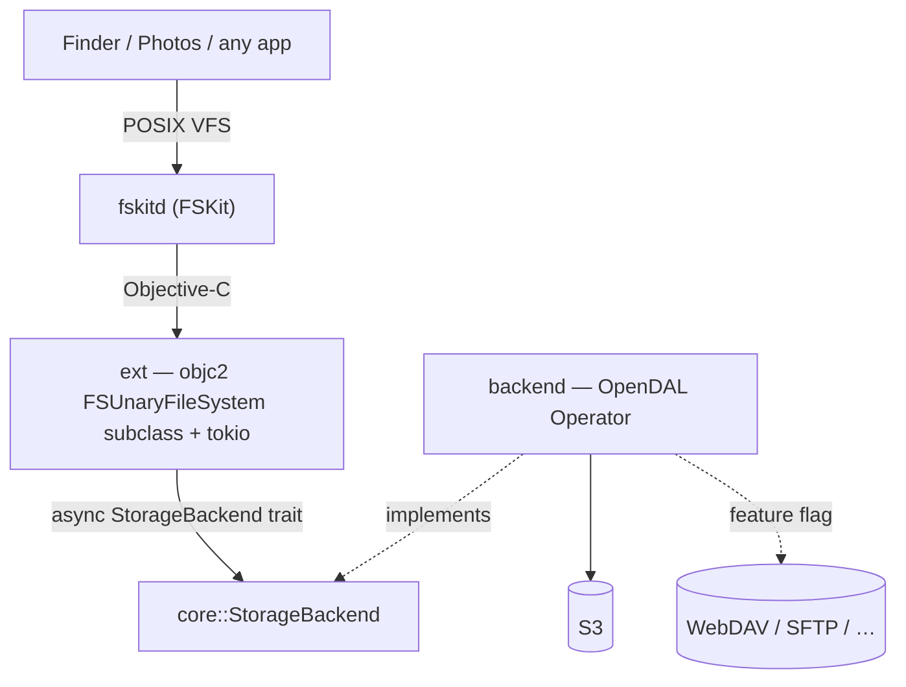

# Contributing to fskit-s3


This is the contributor guide — how the pieces fit, how the secret travels, how
to mount by hand, and how to build and test. For the full design rationale and
the FSKit runtime gotchas, see [`CLAUDE.md`](CLAUDE.md).

## Architecture



FSKit hands the extension a tiny request vocabulary that maps 1:1 onto the
`StorageBackend` trait:

- `enumerateDirectory` → `list`
- `lookupItemNamed` / `getAttributes` → `stat`
- `readFromFile … offset length` → `read`

The trait is **async**; the extension holds a tokio runtime and fires FSKit's
reply blocks as tasks complete, so latency-bound network reads run concurrently.
The whole project is Rust — FSKit is driven directly via `objc2` (it ships plain
Objective-C headers) and the app UI is SwiftUI over a UniFFI contract to the Rust
core. See [`CLAUDE.md`](CLAUDE.md) for the full design and rationale.

## Mounting by hand

The app is not required — a connection is realised by the system `mount` tool, so
a plain `mount` does the same thing the app does. The config rides the **source
path** (a self-describing `/s3/<name>?…`, which the extension resolves at load
time); only the secret travels separately.

```sh
# -F = FSKit module, -t = which one. The first path is the SOURCE (the config,
# which needn't exist on disk); the second is the mount point.

# Secret inline — no setup, but insecure (visible in `ps`/`mount`):
mount -F -t fskit-s3 -o secret=s3cr3t \
  "/s3/photos?bucket=my-bucket&access_key_id=AKIA…&region=us-east-1" \
  ~/fskit-s3/photos

# …or store the secret in the Keychain (item keyed by `name`), then omit it:
security add-generic-password -U -s dev.lucsoft.fskit-s3 -a photos -w 's3cr3t'
mount -F -t fskit-s3 \
  "/s3/photos?bucket=my-bucket&access_key_id=AKIA…&region=us-east-1" \
  ~/fskit-s3/photos

umount ~/fskit-s3/photos

# the in-memory demo (no credentials):
mount -F -t fskit-s3 /memory ~/fskit-s3/memory
umount ~/fskit-s3/memory
```

### How the secret travels

The Keychain item the **extension** reads lives in a signed, team-scoped access
group that only the app can write — so `security add-generic-password` above
suits your own CLI experiments; the app is what populates the shared item for a
normal install.

On an **unsigned dev build** the extension can't read that shared group at all, so
the New/Edit Connection form also offers **Save secret to disk (dev)** — a `0600`
plaintext file (`~/Library/Application Support/fskit-s3/secrets/<name>`) the app
reads back and passes via `-o secret`, so one-click and launch mounts stop
re-prompting. It's insecure (plaintext, and visible in `ps`/`mount` at mount time);
signed installs should use the Keychain instead.

## Build & test (no Xcode needed)

```sh
cargo test          # core + backend, against OpenDAL's in-memory service
cargo clippy --all-targets -- -D warnings
cargo fmt --all
```

### Live integration tests (against a real S3)

The `#[ignore]`d live integration tests in `backend/tests/live_s3.rs` exercise
the write path against a real S3 endpoint — a full file lifecycle (create →
update → update → check stats + modified → delete), mtime stability, and
server-side rename. They default to the local RustFS from `compose.yaml`:

```sh
docker compose up -d                                                 # local S3 on :9000
RUSTFS_ENDPOINT=http://localhost:9000 \
  cargo test -p fskit-s3-backend --test live_s3 -- --ignored --nocapture
docker compose down                                                  # add -v to wipe data
```

Point them at any other S3 (real AWS, MinIO, R2, …) by setting `RUSTFS_ENDPOINT`
to its URL and overriding the `FSKIT_S3_BUCKET` / `FSKIT_S3_REGION` /
`FSKIT_S3_ACCESS_KEY_ID` / `FSKIT_S3_SECRET_ACCESS_KEY` env vars.

### End-to-end (through the real mount)

`backend/tests/live_s3.rs` drives the `StorageBackend` trait directly.
`scripts/e2e-mount.sh` goes a layer up and exercises the whole stack the way a
user does — `/sbin/mount -F -t fskit-s3` → `fskitd` → the extension → the backend
— running the same lifecycle (create → update → update → stat/modified →
truncate → rename → delete, plus a directory) with plain shell tools on a fresh,
throwaway mount point, then unmounting. It needs the extension **installed and
enabled** (it tests whatever build is currently installed, so rebuild the host
app first to exercise new ext code).

```sh
scripts/e2e-mount.sh s3        # against the compose.yaml RustFS (default)
scripts/e2e-mount.sh memory    # the credential-free in-memory demo
```

It uses a unique per-run mount point and connection name, cleans up after itself,
and never touches any existing mount.

## Signing & entitlements

Building a loadable FSKit module needs code signing and the restricted
`com.apple.developer.fskit.fsmodule` entitlement, which generally requires a
**paid** Apple Developer Program membership plus the FSKit Module capability on
the App ID. See [`xcode/README.md`](xcode/README.md) for the build / enable /
triage details.

## Change workflow

Every code change follows the same loop — **never edit `main` directly**:

1. **Enter a worktree** — start each change on its own branch/checkout so `main`
   stays untouched.
2. **Complete the change** and get it green: `cargo test`,
   `cargo clippy --all-targets -- -D warnings`, and `cargo fmt --all` must all
   pass.
3. **Ask for approval** — summarise what changed and wait for an explicit
   go-ahead. Don't push unreviewed work.
4. **Push to `main`** once approved.
5. **Leave the worktree** — it's removed once its work is merged.

### Conventions

- Code, comments, and commit messages in **English**.
- Async everywhere below the FSKit boundary; keep `core` dependency-light.
- New backend behavior gets a unit test against OpenDAL's memory service (no live
  bucket in tests/CI). Live-endpoint tests are `#[ignore]`d and opt-in via env.
- Errors cross the trait as `StorageError`; the extension is the single place
  that maps them to errno / `FSKitError`.
- **No panics in library code** — `unwrap`/`expect`/`panic!`/indexing are denied
  by clippy outside `#[cfg(test)]`.
- **Wrap `unsafe` in checked safe functions** — all `objc2`/FFI `unsafe` lives
  behind a small safe wrapper that validates arguments and null-checks results.
- **Pin dependency features; no `default-features`** — see the `objc2` note in
  [`CLAUDE.md`](CLAUDE.md) for why this matters.

### Adding a storage backend (e.g. WebDAV)

1. Enable the OpenDAL feature in `backend/Cargo.toml` (`services-webdav`).
2. Add a constructor next to `OpenDalBackend::s3` that builds the `Operator`.
3. Route to it from the extension's config path. The trait, `core`, and the
   FSKit glue don't change.
