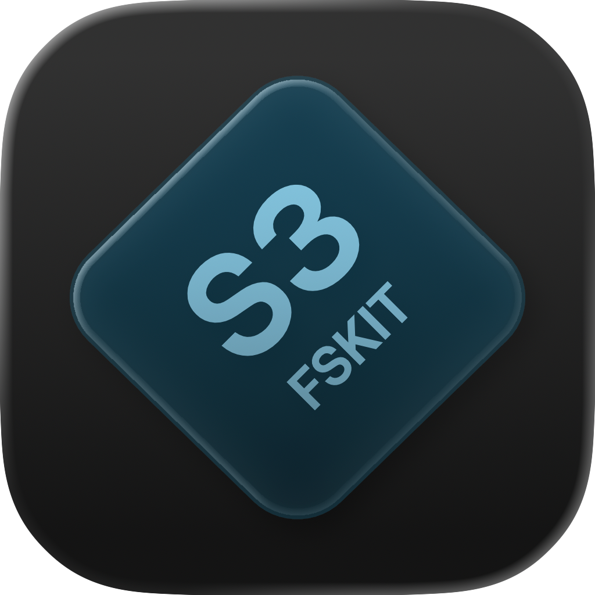
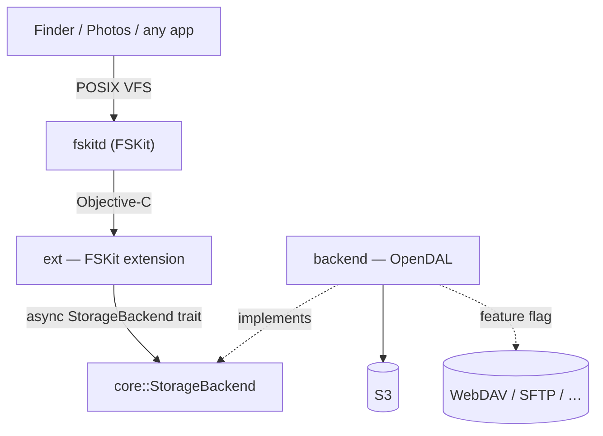

# fskit-s3

**Mount an S3 bucket as a folder on your Mac.** Open it in Finder, browse it,
read and write files — like any other drive, except the bytes live in object
storage. No kernel extension, no macFUSE, no security downgrade.

It's built on **FSKit**, Apple's built-in framework for filesystems that run as
normal apps (macOS 15.4+, tested on 26). The name says S3, but the design isn't
tied to it — WebDAV, SFTP, and other services are on the roadmap.

## Quick start

**1. Install the app.** macOS loads the filesystem from a host app, so you
install and run that app once:

```sh
xcodegen generate && open fskit-s3.xcodeproj   # pick your team, then Build & Run
```

(Code signing needs a paid Apple Developer account — see
[`CONTRIBUTING.md`](CONTRIBUTING.md).)

**2. Enable the extension.** The app appears as a ☁ item in your menu bar. On
first launch it checks whether the filesystem extension is turned on and, if not,
opens a window that links you to the right settings pane:
**System Settings ▸ Login Items & Extensions ▸ File System Extensions**. Turn it
on there.

**3. Mount a bucket.** From the ☁ menu, pick **New Connection…** and fill in the
form — endpoint, bucket, region, and your access keys. The secret is saved to
your Keychain.

The menu then mounts and unmounts each connection. That's it — the bucket shows
up as a folder you can open in Finder.

### Mounting from the command line

There's no custom CLI — a connection is just the system `mount` tool. The first
path is the bucket config (it doesn't need to exist on disk); the second is the
folder to mount it at.

```sh
# With the secret in your Keychain (recommended). Store it once, keyed by the
# connection name, then mount without repeating it:
security add-generic-password -U -s dev.lucsoft.fskit-s3 -a photos -w 's3cr3t'
mount -F -t fskit-s3 \
  "/s3/photos?bucket=my-bucket&access_key_id=AKIA…&region=us-east-1" \
  ~/fskit-s3/photos

# Or pass the secret inline — no setup, but insecure (it's visible to `ps`/`mount`):
mount -F -t fskit-s3 -o secret=s3cr3t \
  "/s3/photos?bucket=my-bucket&access_key_id=AKIA…&region=us-east-1" \
  ~/fskit-s3/photos

# Unmount either of them:
umount ~/fskit-s3/photos
```

See [mounting by hand](CONTRIBUTING.md#mounting-by-hand) for how the secret
travels and the unsigned-dev-build caveat.

## How it works



Your Mac talks to the extension the way it talks to any disk — list a folder,
read a file, write a file. The extension turns those requests into object-storage
operations. Everything above the storage layer is generic, so adding a new
service is a small, contained change.

The whole project is written in Rust, using [Apache OpenDAL](https://opendal.apache.org)
for the storage side (~40 services behind one interface). For the full design,
rationale, and contributor guide, see [`CONTRIBUTING.md`](CONTRIBUTING.md) and
[`CLAUDE.md`](CLAUDE.md).

## Status

- [x] Browse and read files (list + read)
- [x] Write files (create / write / truncate / rename / remove)
- [x] SwiftUI menu-bar app — manage connections, Keychain secrets, mounting
- [x] Verified end-to-end against a real S3 bucket on a signed build
- [ ] Mount via `s3://` URL scheme
- [ ] Graceful handling of flaky networks (timeouts, disconnects)
- [ ] More backends — WebDAV, SFTP
- [ ] Local cache layer so hot files stay on disk
- [ ] Hosting a Photos library (needs a different FSKit flavor — see [`CLAUDE.md`](CLAUDE.md))

## License

MIT
