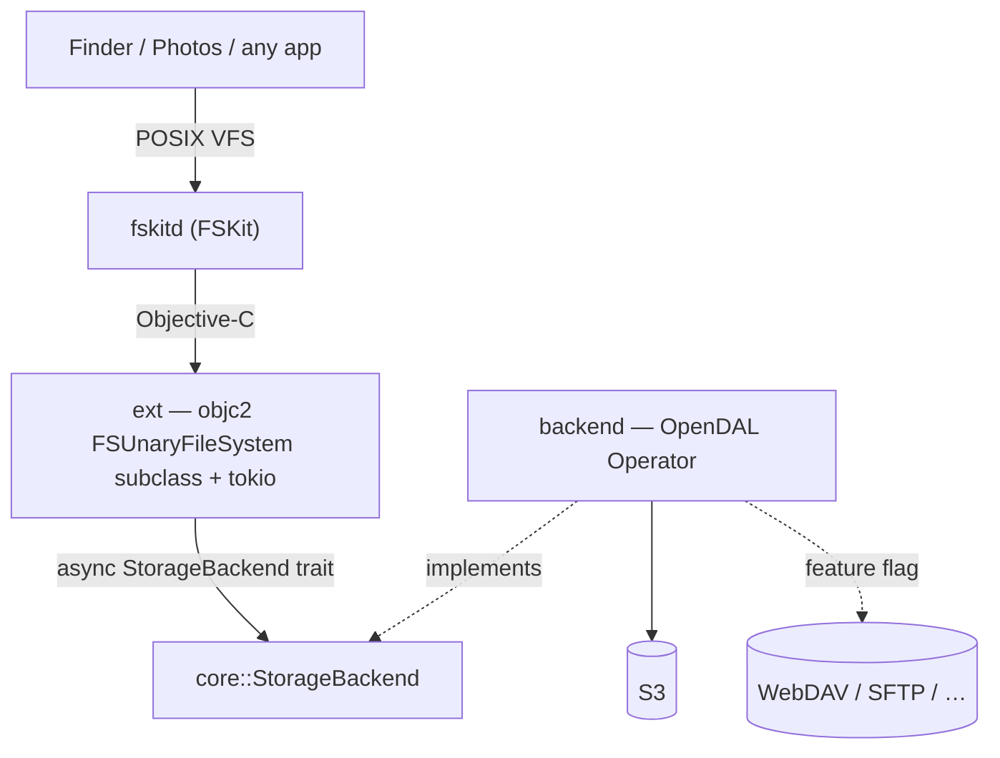

# fskit-s3

**Mount an S3 bucket as a folder on your Mac.** Open it in Finder, browse it,
read files from it — like any other drive, except the bytes live in object
storage. No kernel extension, no macFUSE, no security downgrade.

It works by building on **FSKit**, Apple's userspace filesystem framework
(macOS 26+). The name says S3, but nothing in the design is S3-specific: storage
sits behind one small trait implemented over [Apache OpenDAL](https://opendal.apache.org),
so WebDAV, SFTP, and ~40 other services are a feature flag away.

## Quick start

**First, install the extension.** macOS loads the filesystem from a host app.
Generate the Xcode project, then build and run the host:

```sh
xcodegen generate && open fskit-s3.xcodeproj   # pick your team, Build & Run fskit-s3-host
```

The host (`fskit-s3-host`) vends the `fskit-s3-ext` extension; enable it in
**System Settings ▸ Login Items & Extensions ▸ File System Extensions**. Signing
and the FSKit entitlement (needs a paid Apple team) are covered in
[`CLAUDE.md`](CLAUDE.md).

**Then mount something.** The app is a ☁ menu-bar item. **Add mount…** creates a
connection — an in-memory demo, or an S3 bucket (endpoint / bucket / region /
keys, secret saved to your Keychain) — and the menu mounts and unmounts it.

```sh
cargo run -p fskit-s3-app
```

There's no bespoke CLI: a connection is just the system `mount` tool with the
config passed as `-o` options, so you can also do it by hand.

```sh
# -F: the filesystem is an FSKit module   -t fskit-s3: which module
# (macOS `mount` is BSD-style — these flags have no --long-form spelling)
# The path is repeated: mount needs a resource arg, but its contents are never
# read (the backend comes from -o), so the mount point serves as its own resource.

# Secret inline — no setup, but insecure (visible in `ps`/`mount`):
mount -F -t fskit-s3 \
  -o type=s3,name=photos,bucket=my-bucket,access_key_id=AKIA…,region=us-east-1,secret=s3cr3t \
  ~/fskit-s3/photos ~/fskit-s3/photos

# …or store the secret in the Keychain (item keyed by `name`), then omit it:
security add-generic-password -U -s dev.lucsoft.fskit-s3 -a photos -w 's3cr3t'
mount -F -t fskit-s3 \
  -o type=s3,name=photos,bucket=my-bucket,access_key_id=AKIA…,region=us-east-1 \
  ~/fskit-s3/photos ~/fskit-s3/photos

umount ~/fskit-s3/photos
```

The Keychain item the **extension** reads lives in a signed, team-scoped access
group that only the app can write — so `security add-generic-password` above
suits your own CLI experiments; the app is what populates the shared item for a
normal install.

## How it works



FSKit hands the extension a tiny request vocabulary that maps 1:1 onto the
trait:

- `enumerateDirectory` → `list`
- `lookupItemNamed` / `getAttributes` → `stat`
- `readFromFile … offset length` → `read`

The trait is **async**; the extension holds a tokio runtime and fires FSKit's
reply blocks as tasks complete, so latency-bound network reads run concurrently.
The whole project is Rust — FSKit is driven directly via `objc2` (it ships plain
Objective-C headers). See [`CLAUDE.md`](CLAUDE.md) for the full design and
rationale.

## Build & test (no Xcode needed)

```sh
cargo test          # core + backend, against OpenDAL's in-memory service
```

Against a real S3 endpoint (local RustFS via `compose.yaml`):

```sh
docker compose up -d                                                 # local S3 on :9000
RUSTFS_ENDPOINT=http://localhost:9000 cargo test -p fskit-s3-backend -- --ignored
docker compose down                                                  # add -v to wipe data
```

## TODO

- [x] `core` — async `StorageBackend` trait + path/key helpers + in-memory demo
- [x] `backend` — `StorageBackend` over OpenDAL (S3), tested against its in-memory service
- [x] `ext` — mounts and serves files on macOS 26 (in-memory demo + real S3 bucket)
- [x] `app` — connection model, Keychain secrets, and mounting (config as `mount -o` options)
- [x] Read-only browsing: list + read
- [ ] Verify the S3 path end-to-end on a signed build (framework linking + reading the shared Keychain group from the `fskitd` sandbox)
- [ ] Move "Test & Save" off the main thread (the credential check blocks the UI while listing the bucket)
- [ ] More backends — WebDAV, SFTP (OpenDAL feature flag + constructor; trait and FSKit glue don't change)
- [ ] Write support (the volume is read-only today; mutating ops reply `EROFS`)
- [ ] The Photos question — needs a block-device FSKit filesystem, not the unary one here; a separate track (see [`CLAUDE.md`](CLAUDE.md))

## License

MIT
