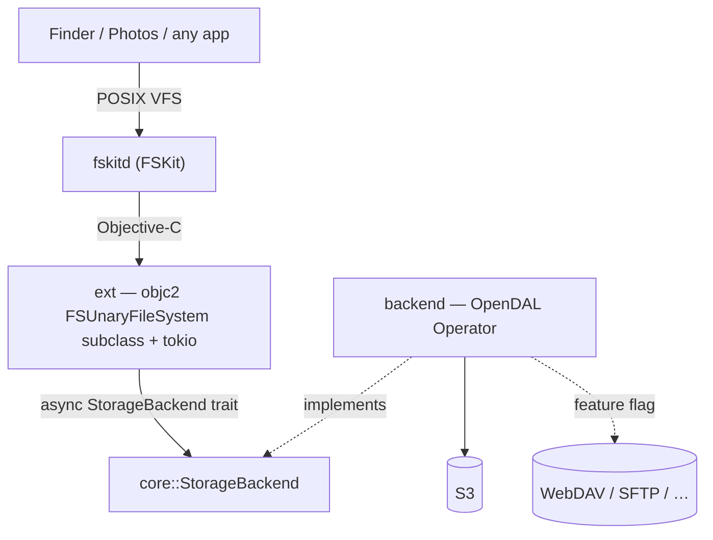

# fskit-s3

**Mount an S3 bucket as a folder on your Mac.** Open it in Finder, browse it,
read files from it — like any other drive, except the bytes live in object
storage. No kernel extension, no macFUSE, no security downgrade.

It works by building on **FSKit**, Apple's userspace filesystem framework
(macOS 15.4+, only tested 26). The name says S3, but nothing in the design is S3-specific: storage
sits behind one small trait implemented over [Apache OpenDAL](https://opendal.apache.org),
so WebDAV, SFTP, and ~40 other services are a feature flag away.

## Quick start

**First, install the extension.** macOS loads the filesystem from a host app —
which here is the app itself. Generate the Xcode project, then build and run it:

```sh
xcodegen generate && open fskit-s3.xcodeproj   # pick your team, Build & Run fskit-s3-host
```

The app (`fskit-s3-host`) vends the `fskit-s3-ext` extension; enable it in
**System Settings ▸ Login Items & Extensions ▸ File System Extensions**. On first
launch the app's ☁ menu shows the extension's health and, if it isn't enabled yet,
pops a window that deep-links you straight to that pane. It also registers itself
to launch at login. Signing and the FSKit entitlement (needs a paid Apple team)
are covered in [`CLAUDE.md`](CLAUDE.md).

**Then mount something.** The app is a ☁ menu-bar item (a native SwiftUI
`MenuBarExtra`; its health row shows the extension's state). **New Connection…**
creates a connection — an in-memory demo, or an S3 bucket (endpoint / bucket /
region / keys, secret saved to your Keychain) — and the menu mounts and unmounts it.

The UI is SwiftUI over a UniFFI contract to the Rust core, so iterate it in Xcode
(SwiftUI previews), or rebuild + install the whole bundle:

```sh
scripts/dev-app.sh        # build the bundle -> install to /Applications -> launch
```

There's no bespoke CLI: a connection is just the system `mount` tool. The config
rides the **source path** (a self-describing `/s3/<name>?…`, which the extension
resolves at load); only the secret travels as an `-o` option (or the Keychain).
So you can also do it by hand.

```sh
# -F = FSKit module, -t = which one. The first path is the SOURCE (the config,
# which needn't exist on disk); the second is the mount point.

# Secret inline — no setup, but insecure (visible in `ps`/`mount`):
mount -F -t fskit-s3 -o secret=s3cr3t \
  "/s3/photos?bucket=my-bucket&access_key_id=AKIA…&region=us-east-1" \
  ~/fskit-s3/photos

# …or store the secret in the Keychain (item keyed by `name`), then omit it:
security add-generic-password -U -s dev.lucsoft.fskit-s3 -a photos -w 's3cr3t'
mount -F -t fskit-s3 \
  "/s3/photos?bucket=my-bucket&access_key_id=AKIA…&region=us-east-1" \
  ~/fskit-s3/photos

umount ~/fskit-s3/photos
```

The Keychain item the **extension** reads lives in a signed, team-scoped access
group that only the app can write — so `security add-generic-password` above
suits your own CLI experiments; the app is what populates the shared item for a
normal install.

## How it works



FSKit hands the extension a tiny request vocabulary that maps 1:1 onto the
trait:

- `enumerateDirectory` → `list`
- `lookupItemNamed` / `getAttributes` → `stat`
- `readFromFile … offset length` → `read`

The trait is **async**; the extension holds a tokio runtime and fires FSKit's
reply blocks as tasks complete, so latency-bound network reads run concurrently.
The whole project is Rust — FSKit is driven directly via `objc2` (it ships plain
Objective-C headers). See [`CLAUDE.md`](CLAUDE.md) for the full design and
rationale.

## Build & test (no Xcode needed)

```sh
cargo test          # core + backend, against OpenDAL's in-memory service
```

The `#[ignore]`d live integration tests in `backend/tests/live_s3.rs` exercise
the write path against a real S3 endpoint — a full file lifecycle (create →
update → update → check stats + modified → delete), mtime stability, and
server-side rename. They default to the local RustFS from `compose.yaml`:

```sh
docker compose up -d                                                 # local S3 on :9000
RUSTFS_ENDPOINT=http://localhost:9000 \
  cargo test -p fskit-s3-backend --test live_s3 -- --ignored --nocapture
docker compose down                                                  # add -v to wipe data
```

Point them at any other S3 (real AWS, MinIO, R2, …) by setting `RUSTFS_ENDPOINT`
to its URL and overriding the `FSKIT_S3_BUCKET` / `FSKIT_S3_REGION` /
`FSKIT_S3_ACCESS_KEY_ID` / `FSKIT_S3_SECRET_ACCESS_KEY` env vars.

### End-to-end (through the real mount)

`backend/tests/live_s3.rs` drives the `StorageBackend` trait directly.
`scripts/e2e-mount.sh` goes a layer up and exercises the whole stack the way a
user does — `/sbin/mount -F -t fskit-s3` → `fskitd` → the extension → the backend
— running the same lifecycle (create → update → update → stat/modified →
truncate → rename → delete, plus a directory) with plain shell tools on a fresh,
throwaway mount point, then unmounting. It needs the extension **installed and
enabled** (it tests whatever build is currently installed, so rebuild the host
app first to exercise new ext code).

```sh
scripts/e2e-mount.sh s3        # against the compose.yaml RustFS (default)
scripts/e2e-mount.sh memory    # the credential-free in-memory demo
```

It uses a unique per-run mount point and connection name, cleans up after itself,
and never touches any existing mount.

## TODO

- [x] `core` — async `StorageBackend` trait + path/key helpers + in-memory demo
- [x] `backend` — `StorageBackend` over OpenDAL (S3), tested against its in-memory service
- [x] `ext` — mounts and serves files on macOS 26 (in-memory demo + real S3 bucket)
- [x] `app` — SwiftUI menu-bar app over a UniFFI contract to the Rust core (connections, Keychain secrets, mounting)
- [x] Read-only browsing: list + read
- [x] "Test & Save" credential check runs off the main actor (no UI stall)
- [ ] Verify the S3 path end-to-end on a signed build (framework linking + reading the shared Keychain group from the `fskitd` sandbox)
- [ ] More backends — WebDAV, SFTP (OpenDAL feature flag + constructor; trait and FSKit glue don't change)
- [ ] Write support (the volume is read-only today; mutating ops reply `EROFS`)
- [ ] The Photos question — needs a block-device FSKit filesystem, not the unary one here; a separate track (see [`CLAUDE.md`](CLAUDE.md))

## License

MIT
