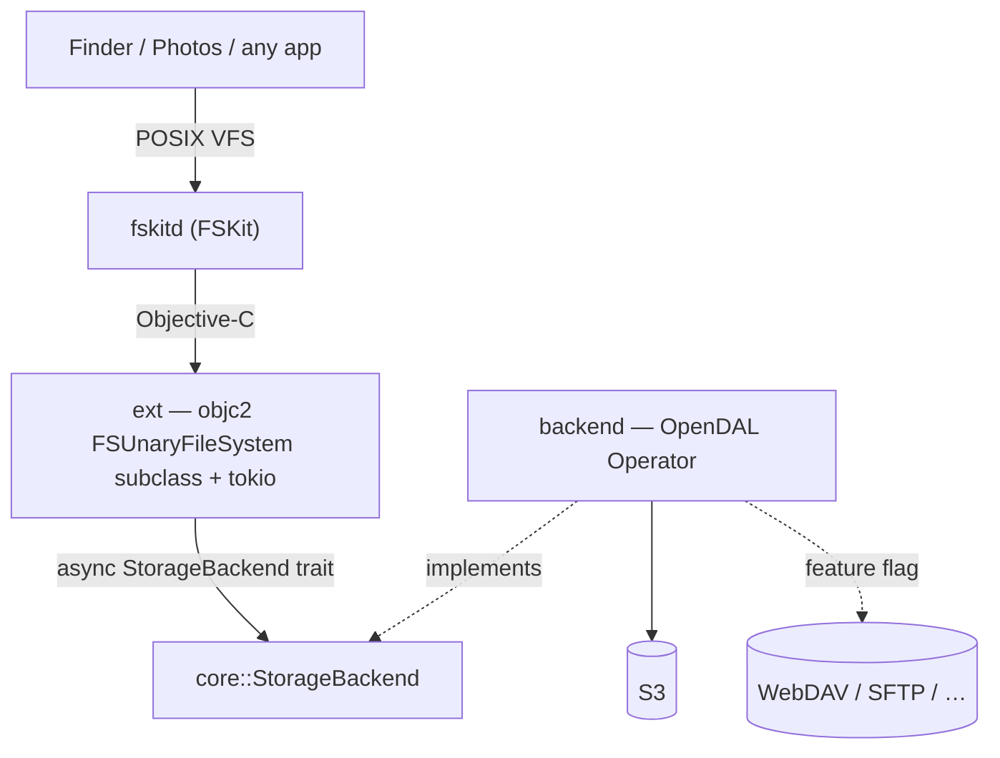

# fskit-s3

Mount an S3 bucket (or any object store) as a native macOS volume, using Apple's
**FSKit** — a userspace filesystem, **no kernel extension, no security
downgrade**. Written in Rust; FSKit is driven directly from Rust via `objc2`
(FSKit ships plain Objective-C headers), the same way the sibling `wayland-macos`
project drives AppKit.

The name says S3, but the design is backend-agnostic: FSKit is mapped onto one
small async trait (`StorageBackend`), implemented once over
[Apache OpenDAL](https://opendal.apache.org). S3 is the first service enabled;
WebDAV, SFTP, and ~40 others are a feature flag away.

## Status

- **`core`** — async `StorageBackend` trait + path/key helpers + in-memory demo.
  ✅ Complete and tested.
- **`backend`** — `StorageBackend` over OpenDAL (`services-s3`).
  ✅ Compiles and tested against OpenDAL's in-memory service. No live bucket wired
  into CI (there's an ignored test for that — see below).
- **`ext`** — FSKit extension in Rust (`objc2` `FSUnaryFileSystem`/`FSVolume`/
  `FSItem` subclasses + tokio bridge). ✅ **Mounts and serves files on macOS 26**;
  `loadResource` picks the backend from the mount `-o` options — the in-memory
  demo, or a **real S3 bucket** (secret from the shared Keychain group). Needs full
  Xcode + a paid team for the FSKit entitlement (see [`CLAUDE.md`](CLAUDE.md)).
- **`app`** — the macOS app (a status-bar app). Owns the **connection** model
  (In-memory | S3, persisted, secret in the Keychain), the **mount** logic
  (config as `mount -o` options, no bespoke CLI), and the UI: an *Add mount…* form
  with *Test & Save*, plus per-connection Mount/Unmount. ✅
- **`xcode/` + `project.yml`** — the ExtensionKit host app + extension target
  (Swift `@main` bootstrap over the Rust staticlib), generated by `xcodegen`.

Read-only (list + read). Connections are In-memory or S3, persisted to
`connections.json` (never the secret). **Next:** verify the S3 path on a signed
build (framework linking + reading the shared Keychain group from the extension
sandbox); move "Test & Save" off the main thread; edit/remove in the connection
UI. Target: a general-purpose bucket mount.

## Managing mounts

The ☁ status-bar app's **Add mount…** creates a connection (In-memory or S3, with
*Save to Keychain* / *Mount when launching* / *Test & Save*); the menu mounts and
unmounts them. There's no bespoke CLI — a connection is realised by `mount` with
its config as `-o` options, so the app and a plain command do the same thing:

```sh
cargo run -p fskit-s3-app                # the app
# …or by hand (the extension needs an explicit `kind`):
mount -F -t fskit-s3 -o kind=memory ~/fskit-s3/.sources/memory ~/fskit-s3/memory
umount ~/fskit-s3/memory
```

## Architecture



FSKit's request vocabulary maps 1:1 onto the trait:

- `enumerateDirectory` → `list`
- `lookupItemNamed` / `getAttributes` → `stat`
- `readFromFile … offset length` → `read`

The trait is **async**; the ext holds a tokio runtime and fires FSKit's reply
blocks on task completion, so latency-bound network reads run concurrently. See
[`CLAUDE.md`](CLAUDE.md) for the full design and rationale.

## Build & test (works today, no Xcode)

```sh
cargo test          # core + backend, against OpenDAL's in-memory service
```

### Testing against a real S3 endpoint (RustFS)

```sh
docker compose up -d                                                  # local S3 on :9000
RUSTFS_ENDPOINT=http://localhost:9000 cargo test -p fskit-s3-backend -- --ignored
docker compose down                                                  # add -v to wipe data
```

## Building & running the extension (needs full Xcode + a paid team)

```sh
xcodegen generate && open fskit-s3.xcodeproj   # pick your team, Build & Run
# enable in System Settings ▸ Login Items & Extensions ▸ File System Extensions
mount -F -t fskit-s3 /tmp/src /tmp/fskit-s3 && ls /tmp/fskit-s3
```

Full steps, signing, and the FSKit runtime gotchas are in
[`CLAUDE.md`](CLAUDE.md) › _Building &amp; running the extension_.

## License

MIT
